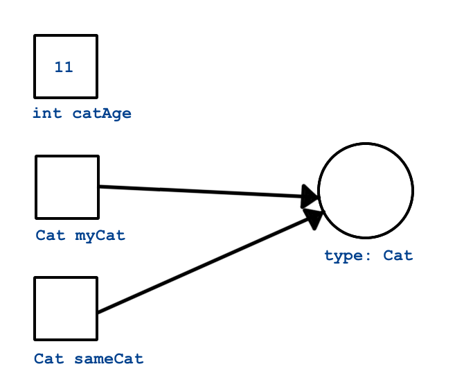

Classes: A Primer
=====================

Now that you have a better understanding of methods, we should touch on classes and objects *briefly*.  
These are big concepts in C#, and OOP in general.  
This chapter is designed to help you get familiar with the larger concepts of classes and objects.
We will explore definitions and walkthrough examples that will demonstarate how classes, objects, and methods work together.

Class Type
-------------------

Quick refesher on data types.  As discussed in the :ref:`Data and Variables <data-and-variables>` chapter, C# contains value types and reference types.  
An **int** or **char** are examples of value data types.
While **strings** are reference types.  Classes are also reference data types that define objects, and objects are also reference types. 

If you remember, a reference type does not contain the actual value.  
Instead it holds a reference point that leads to the memory location of the data. 

.. admonition:: Example

   If we have a class ``Cat`` with a constructor that takes no arguments, we
   declare and create a new instance of ``Cat`` using its constructor.

   .. sourcecode:: csharp

      Cat myCat = new Cat();

   #. ``Cat myCat`` declares the variable ``myCat`` and sets it to be of type
      ``Cat``.
   #. ``= new Cat()`` initializes the variable with a new ``Cat`` object with the keyword ``new``. 
   #. Any arguments that are required to build the new ``Cat`` object must be
      included within the parentheses. In this case, there are no required arguments.  Note the empty ``()``.

This statement creates a new variable that is initialized to
hold a new ``Cat`` object. Note that in C#, we must declare the
variable’s type. Also note that we precede the constructor with the
``new`` keyword. And, as we'll see with all C# statements, the 
declaration ends with a semi-colon.  

Variables and parameters that are of the type of a class are said to be
of **reference type** (in contrast to **primitive type**). In plain
English, we would say of the C# example: “``myCat`` is a reference
variable of type ``Cat``.”

As mentioned above, classes define reference types. A variable of a
reference type (such as ``myCat`` above) does not actually store the
object in question. Instead, it stores a **reference** to the object. A
reference is literally a memory address. We visualize references as an
arrow pointing to the object in memory.

Consider this code:

.. sourcecode:: csharp

   int catAge = 11;
   Cat myCat = new Cat();
   Cat sameCat = myCat;

Visually, we can represent these three variables as shown here.

      Both myCat and sameCat point back to the Cat class type. 

   Reference Types

Since ``int`` is a value type, the variable ``catAge`` functions as a
box holding the integer value ``11``. On the other hand, ``myCat`` is a
reference variable, since it refers to an object of type ``Cat``. The 
variable actually stores the memory address of the object, which we visualize 
as an arrow from the variable box to the object. Instead of holding the actual ``Cat``
data, ``myCat`` stores *directions* for finding the data in memory.

When we assign ``myCat`` to another variable, as in ``Cat sameCat = myCat``,
we do NOT create a second copy of the object or its data. Instead, we make a
second *pointer* to the same memory location.

The distinction between reference types and value types is important,
but can be difficult to wrap your brain around at first. We will see
that reference types are handled differently in essential and important
ways in a lot of different situations.

.. index:: ! boxing, ! unboxing 

Boxing
^^^^^^

All types in C# are treated as objects. Even value types. This can be accomplished 
through processes called boxing and unboxing. Converting from a value type to a reference type is called 
**boxing**, and the reverse process (reference to value) is called **unboxing**. C# is known as a unified 
type system because it implicitly boxes values types to be treated as objects.   

.. sourcecode:: csharp

   int i = 123;     // This is a value type.
   object o = i;    // Boxing the value type into a reference type.
   int j = (int)o;  // Unboxing the reference type back into a value type.

Check Your Understanding
--------------------------

.. admonition:: Question

   How would we instantiate a new Cat object ``reneesCat`` in the Main method?

   #. ``reneesCat.Cat()``
   #. ``string cat = new Cat();``
   #. ``Cat reneesCat = new Cat();``
   #. ``Cat() reneesCat = new Cat();``

.. ans: c, Cat reneesCat = new Cat();