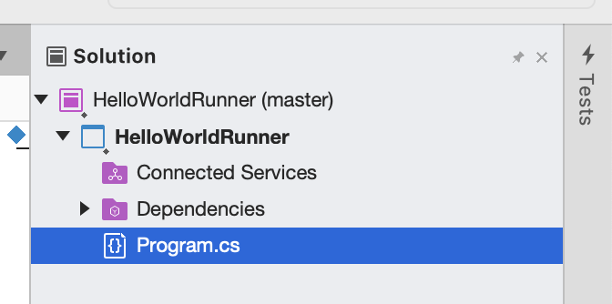
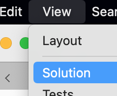
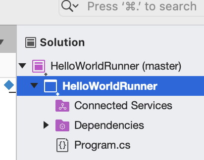
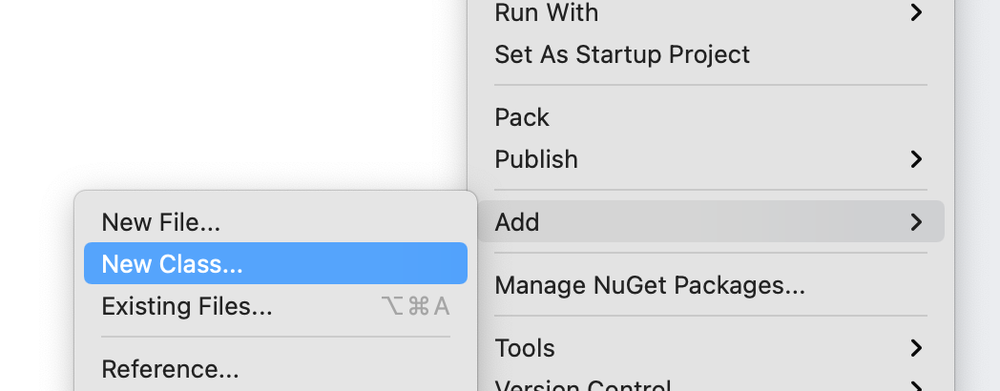
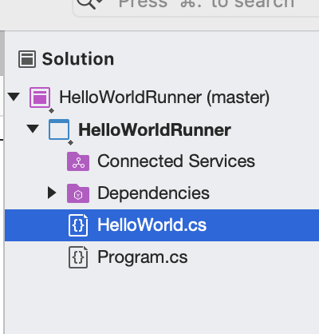

.. _creating-new-class:

Classes for C#
==============

.. index:: ! classes, ! class, ! object, ! objects

In a :ref:`previous chapter <classes-objects-math>`, you were introduced to the ideas of classes, class memebers and how to instantiate objects.  
The examples in that chapter were already built for you in an IDE that was not Visual Studio.
The goal for this chapter and the next is to provide you with confidence for using Visual Studio to creating classes of your own and populating them as you desire.

Before we start: There are three different code examples that you will encounter in *this* chapter. 

* The first example is a program called ``HelloWorldRunner``.  
   The book will walk through how to build and modify this program.  We suggest you build along with the book.  
* The second example will walk through a ``Student`` class.  
   This example will be used later in the exercises. We suggest working with this code at the time of the exrcises, using the book as a reference point.
* The last code example is the ``Temperature`` app you created in the Exceptions chapter.  
   We will be updating it with concepts from this current chapter.

Creating A New Class In An Exisiting C# Project
-------------------------------------------------

In order to start coding along with the chapter, you need to :ref:`create a new Visual Studio project <create-new-csharp-project>` named ``HelloWorldRunner``.

Next, we want to create a new class.  
You will use your **Solution Explorer** in order to do this.  
The *Solution Explorer* displays the files and folders contained with in your project.
It looks like this:

If you don't see your *Solution Explorer* right away, look in the *View* menu.

Now that you have your *Solution Explorer*, we can add a new class!

We want to add the class to our current project ``HelloWorldRunner``, not the solution (which has the same name in this example).
Click on your the project with your secondary button (the "wrong" click on a mouse or ``control + click`` on a touchpad).
This should bring up a large pop-up menu.

   
The project is contained within your solution.  
So far we have matched the names of our solution with our project, but they don't have to match.

In the middle of the menu, you should see ``Add  >``.  Go ahead and click that.
A new menu pops up where you can select what you want to add.  
Select ``New Class...``.

After clicking ``New Class...``, a new window will pop up asking what exactly you want to create and what you want to call it.
Select ``Empty Class`` (which should be the default option). 
At the bottom of this window, you will see an option to name your new class.
Let's name it ``HelloWorld``.

If you look at your *Solution Explorer*, you should see that your new class has been added.
They are listed in alphabetical order.  

Now you are ready to code-a-long.

A Minimal Class and Object
--------------------------

.. index:: ! fields, ! methods, ! members

Classes may contain **fields** and **methods**. Fields contain the data of a
class and methods define actions a class can take. We say that fields and
methods are **members** of a class.

.. admonition:: Example

   Let's create a class called ``HelloWorld`` with one field, ``message``, and one method, ``SayHello()``.
   ``message`` will be a string and have a value of ``"Hello World"``.
   ``SayHello()`` will not return a specific value and instead print out the value of ``message``.

   .. sourcecode:: c#
      :linenos:

      public class HelloWorld 
      {

         public string message = "Hello World";

         public void SayHello() 
         {
            Console.WriteLine(message);
         }

      }

The only field in the ``HelloWorld`` class is the string ``message``, while the
only method is ``SayHello()``, which prints the value of the ``message`` field
and doesn’t return anything.

.. note::

   Remember, there is no ``Main`` method inside the ``HelloWorld`` class.  
   In order to use our ``SayHello`` method, we would create a way to invoke it inside the ``Main`` method.

.. index:: ! instance

To execute ``SayHello()``, we’ll need to create an **instance** of the
class ``HelloWorld``. We refer to an object created from a particular class as
an instance of that class.

Here’s how this might look with our ``HelloWorld`` class:

.. admonition:: Example

   .. sourcecode:: c#
      :linenos:

      public class HelloWorldRunner 
      {

         public static void main(string[] args) 
         {
               HelloWorld hello = new HelloWorld();
               hello.SayHello();
         }
      }

In order to call the ``SayHello`` method of ``HelloWorld``, we must
first have an instance of ``HelloWorld``, which we create using the
syntax ``new HelloWorld()`` from inside the ``Main`` method. 
If you recall, just as with built-in classes, classes that we create define their own types. 
So the object ``hello`` is a variable of type ``HelloWorld``.

We introduced this ``HelloWorld`` class as a means of illustrating the simplest
representation of some basic concepts in C#. The goal of the next few
lessons is to build up the machinery to create a wide variety of
interesting classes that can be used to create complex programs and
elegantly solve difficult problems.

The ``this`` Keyword
--------------------

.. index:: ! this keyword

In ``HelloWorld`` above, we could have written ``SayHello`` this way,
with the same net effect:

.. sourcecode:: c#
   :lineno-start: 6

   public void SayHello() 
   {
      Console.WriteLine(this.message);
   }

In this context, inside of the class, we can refer to fields (and
methods) that belong to the class using the special object, ``this``.
Whenever you use ``this``, it *always* refers to the object that the
given code is currently within. In other words, ``this`` will always be
an instance of the given class. Since it is not legal to create code
outside of a class in C#, ``this`` nearly always makes sense to use
(there’s one exception, that we’ll encounter soon).

You are allowed to create local variables (variables declared
within a method) with the same name as a field of the given class. In
this case, in order to refer to the field, we *must* use ``this``.

.. admonition:: Example

   Let's look at how this works with our ``HelloWorld`` class:

   .. sourcecode:: c#
      :linenos:

      public class HelloWorld 
      {

         public string message = "Hello World";

         public void SayHello() 
         {

            string message = "Goodbye World";

            // The line below prints "Goodbye World"
            Console.WriteLine(message);

            // The line below prints "Hello World"
            Console.WriteLine(this.message);
         }
      }

.. index:: ! shadowing

.. warning::

   When a local variable has the same name as a field, we say that the
   local variable **shadows** the field. Errors caused by shadowing can be
   tricky to spot, so it’s best to avoid doing this in your code.

.. note::

   If you want to learn more about this subject, check out the documentation on `using the this keyword <https://docs.microsoft.com/en-us/dotnet/csharp/language-reference/keywords/this>`_.

Check Your Understanding
------------------------

.. admonition:: Question

   The following code block contains several bugs. Mark all of the lines that contain a bug in the code.

   .. sourcecode:: c#
      :linenos:

      public class Greeting 
      {
         public String name = "Jess"

         public void SayHello() 
         {
            Console.WriteLine("Hello " + here.name + "!");

      }

   a. line 8
   b. line 4
   c. line 7
   d. line 1

.. ans: lines 4, 8 and 9 all have bugs.
