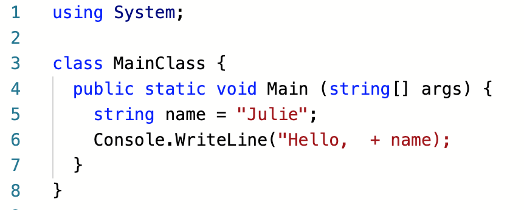

===========================
Diagnosing Error Messages
===========================

Errors *always* produce error messages. Reading and
understanding error messages is a crucial first step in fixing these types of
bugs.

**Error messages are your friends.**  Really.  This idea can seem foreign to new
programmers, because an error message is a signal that your program is broken.
When we are working with a broken program, we might feel frustrated, like we do
not fully understand the concepts at hand.

However, the reality is that *all* programmers, no matter how experienced,
regularly make simple mistakes. If you run your program and it produces an
error message, your first reaction should be, "Great! My program has an error,
but I have a helpful message to help me fix it."

.. _syntax-error:

Compiler Messages 101
----------------------------------------

Those messages from the compiler have a lot useful information in them.  If you know how to read them.

Let's consider the following code snippet.  It contains a syntax error, and will not compile.  
This specific example is for compiler errors, but the steps can be used for warnings and unhandled exceptions.

Running the program at this stage results in the message:

.. replit:: csharp
   :linenos:
   :slug: Compiler-Message-CSharp
   
   using System;

   class MainClass {
      public static void Main (string[] args) {
         
         string name = "Julie";
         Console.WriteLine("Hello,  + name);
      }
   }

**Console Output**

:: 
   
   main.cs(7,39): error CS1010: Newline in constant
   main.cs(8,2): error CS1525: Unexpected symbol `}', expecting `)' or `,'
   main.cs(8,3): error CS1002: ; expected
   Compilation failed: 3 error(s), 0 warnings
   compiler exit status 1

That is a lot of errors in this message.  Quick rule with errors: the **first** error tells us where to start.  
The rest of the errors are typically a result of the first error.  

The first line identifies where in our code the error originated: ``main.cs(7,39): error CS1010: Newline in constant``.

This error number is telling us that error is located in the **main** namespace, **Line 7**, character 39.  
Which, in this case, is the ``;`` or the final character of this line.  Sometimes using the coordinates are enough to help you find the error.
In this case, we see that we have a ``;``  What does that mean?  Perhaps, you can see the problem at this point.  Great!  
If not, it's okay.  This takes practice, and with each error you make, you will be better with your syntax.  
 
Sometimes you might need more information about *why* something is an error.  That is where the error numbers come in handy.  
You are not expected to memorize error numbers.  If you need more information than the snippet that is provided, copy and 
paste the number into your favorite search engine.  That will bring up the Microsoft Documentation, but you might also find other 
sites that discuss the error.  Browse and find an explanation that helps you best understand the error and, hopefully, manage or correct it.

Let's look at our first error message again.

::

   error CS1010: Newline in constant

This line identifies that actual issue that C# found.  If you are scratching your head at the message, "CS1010" or "Newline in constant",
don't worry. Programming languages often report errors in ways that are not always easy to decipher at first glance. 
However, a quick copy and paste can help us find out more.  

Let's start with the `Microsoft Documentation <https://docs.microsoft.com/en-us/dotnet/csharp/misc/cs1010>`__. on this error number.  

::

   Console.WriteLine("Hello,  + name);
               

.. index:: ! token

C# is telling us that in the ``Console.WriteLine`` a string was intiatied, but never closed.  
Without that closing ``"``, it is unable to properly ready any of the other code. 

Fixing this error gives us a program with correct syntax:

.. sourcecode:: csharp
   :linenos:

   using System;

   class MainClass {
      public static void Main (string[] args) {
         
         string name = "Julie";
         Console.WriteLine("Hello, "  + name);
      }
   }

**Console Output**

:: 
   
   Hello, Julie

It prints and there are no more errors.  We did it!  If you notice, you only worked on that first error and all the others
disappeared.  Just work on one error at a time and test, test, test!  Remember, those messages are your friend.

.. note:: Error messages may differ depending on where you run your code. The same program run in a `repl.it <https://repl.it/>`_ and other IDEs on your computer will generate slightly different error messages. However, these differences are minor and generally unimportant. The main cause of the error will be reported in the same way.

The same process can be done for warnings and exceptions too.  Don't be afraid to look around for answers.

.. admonition:: Note
   
   A quick note on Compiler messages.  Sometimes the coordinates of an error are referring to the line *above*.  This is very common when you leave off an ``;``.  Here is a quick example:
   
   .. sourcecode:: csharp
      :linenos:
      
      string name = "Julie"
      Console.WriteLine("Hello, " + name);

   **Console Output**

   ::

     main.cs(2,4): error CS1525: Unexpected symbol `Console'

   If you scour **Line 2** for errors, you are going to drive yourself crazy.  Your **Line 2** is correct.  *Why* does the complier think ``'Console'`` is a symbol?  If you look at **Line 1**, you'll see there is no ``;`` to end the statement, so C# thinks that **Line 2** is part of your inital expression in **Line 1**.
     

Syntax Highlighting
-----------------------------

.. index::
   single: syntax; highlighting

Most code editors provide a feature known as **syntax highlighting**. Such
editors highlight different types of tokens in different ways. For example,
strings may be red, while data types may be blue. This useful feature gives you
a quick, visual way to identify syntax errors.

For example, here is a screenshot of our flawed code taken within an `editor at repl.it <https://repl.it/@launchcode/syntaxHighlightingCSharp>`_.

      Notice, however, there is no highlighting to inform you of you missin ``;``.
      Syntax error on **Line 2** causes highlighting to differ from what is expected.  The ``+``, variable name, and
      symbols ``);`` are red instead of black, because the preceding string "Hello, " doesn't have a closing double-quote.

   Screenshot of a program with one syntax error

Notice that the string ``Hello`` is colored red, while *most* of the symbols
(``=``, ``;``, ``.``, and ``(``) are colored black. At the end of **Line 2**,
however, the final ``)`` and ``;`` are both red rather than black. Since we
haven't closed the string, the editor assumes that these two symbols are *part
of* the string. Since we expect ``);`` to be black in this editor, the
difference in color is a clue that something is wrong with our syntax.