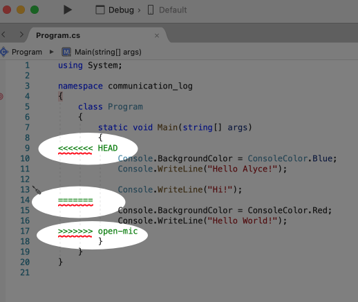

Bonus Mission: Merge Conflicts!
-------------------------------

Merge Conflicts!
^^^^^^^^^^^^^^^^

When collaborating on a project, things won't always go smoothly. It's common
for two people to make changes to the same line(s) of code, at roughly the same
time, which will prevent Git from being able to merge the changes together.

.. figure:: figures/studio/git-merge.gif
   :alt: An animated GIF file showing two opposing armies colliding in a mess

   Git Merge Conflicts

This isn't such a big deal. In fact, it's very common. To see how we can handle
such a situation, we'll intentionally create a merge conflict and then resolve
it.

**Pilot**: Let's change something about the style file. Our Console is looking
pretty plain, so let's change the color and maybe share a joke or something to liven this up.

First, switch back to the ``main`` branch.

::

   $ git checkout main

Stage and commit your changes and push them up to GitHub. If you don't remember
how to do this, follow the instructions above. Make sure you're back in the
``main`` branch! If you're still in ``open-mic``, then your changes will be
isolated, and you won't get the merge conflict you need to learn about.

Meanwhile...

**Control**: Let's change something about the style file that Pilot just
edited. Change the color again.  
Update your current Console.WriteLine statement to make an observation about the weather or something.

Commit your changes to branch ``main``.

Resolving Merge Conflicts
^^^^^^^^^^^^^^^^^^^^^^^^^

**Control**: Try to push your changes up to GitHub. You should get an error
message. How exciting!

::

   $ git push origin main

   To git@github.com:chrisbay/communication-log.git
   ! [rejected]        main -> main (fetch first)
   error: failed to push some refs to 'git@github.com:chrisbay/communication-log.git'
   hint: Updates were rejected because the remote contains work that you do
   hint: not have locally. This is usually caused by another repository pushing
   hint: to the same ref. You may want to first integrate the remote changes
   hint: (e.g., 'git pull ...') before pushing again.
   hint: See the 'Note about fast-forwards' in 'git push --help' for details.

There's a lot of jargon in that message, including some terminology we haven't
encountered. However, the core of the message is indeed understandable to us:
"Updates were rejected because the remote contains work that you do not have
locally." In other words, somebody (Pilot, in this case), pushed changes to the
same branch, and you don't have those changes on your computer. Git will not
let you push to a branch in another repository unless you have incorporated all
of the work present in that branch.

Let's pull these outstanding changes into our branch and resolve the errors.

::

   $ git pull
   remote: Counting objects: 4, done.
   remote: Compressing objects: 100% (3/3), done.
   remote: Total 4 (delta 1), reused 4 (delta 1), pack-reused 0
   Unpacking objects: 100% (4/4), done.
   From github.com:chrisbay/communication-log
      7d7e42e..0c21659  main     -> origin/main
   Auto-merging communication-log.sln
   CONFLICT (content): Merge conflict in communication-log.sln
   Auto-merging communication-log.sln
   CONFLICT (content): Merge conflict in communication-log.sln
   Automatic merge failed; fix conflicts and then commit the result.

Since Pilot made changes to some of the same lines you did, Git was unable to
automatically merge the changes.

The specific locations where Git could not automatically merge files are
indicated by the lines that begin with ``CONFLICT``. You will have to edit
these files yourself to incorporate Pilot's changes. 

   Merge conflicts in ``main`` branch of communication-log, viewed in VS on a Mac.  Windows users, you will see a different screen, but the ``<<<<<<<``,  ``=======`` and ``>>>>>>>`` symbols will be the same.

At the top and bottom, there is some code that could be merged without issue.

Between the ``<<<<<<< HEAD`` and ``=======`` symbols is the version of the code
that exists locally. These are *your* changes.

Between ``=======`` and ``>>>>>>> open-mic...``
are the changes that Pilot made (the hash ``open-mic...`` will be unique to
the commit, so you'll see something slightly different on your screen).

Let's unify our code.   Select which changes you would like to keep, or if possible select all of them.  It's up to you and your partner.

.. tip:: Like many other editors, VS provides fancy buttons to allow you to resolve individual merge conflicts with a single click. There's nothing magic about these buttons; they do the same thing that you can do by directly editing the file.

   Feel free to use them, but beware that they will not always work. If you need to incorporate parts of a change from both branches, you will need to manually edit the file to resolved the conflict.

Don't forget to stage and commit.

Pulling the Merged Code
^^^^^^^^^^^^^^^^^^^^^^^

**Pilot**: Meanwhile, Pilot is sitting at home, minding their own business. A
random ``git status`` seems reassuring:

::

   $ git status
   On branch main
   Your branch is up-to-date with 'origin/main'.
   nothing to commit, working directory clean

Your local Git thinks the status is quo. Little does it know that up at GitHub,
the status is not quo. We'd find this out by doing either a ``git fetch``, or
if we just want the latest version of this branch, ``git pull``:

::

   $ git pull
   remote: Counting objects: 13, done.
   remote: Compressing objects: 100% (8/8), done.
   remote: Total 13 (delta 4), reused 13 (delta 4), pack-reused 0
   Unpacking objects: 100% (13/13), done.
   From Github.com:chrisbay/communication-log
      0c21659..e0de62d  main     -> origin/main
   Updating 0c21659..e0de62d
   Fast-forward
   communication-log.sln | 3 ++-
   1 file changed, 4 insertions(+), 3 deletions(-)

Great Scott! Looks like Control changed the ``communication-log``.
Note that *Pilot* didn't have to deal with the hassle of resolving merge
conflicts. Since Control intervened, Git assumes that the team is okay with the
way they resolved it, and *fast forwards* our local repo to be in sync with the
remote one. Let's look at ``communication-log.sln`` to make sure.  
What do you see?  What color is the text now?  Oh my!

More Merge Conflicts!
^^^^^^^^^^^^^^^^^^^^^

Let's turn the tables on the steps we just carried out, so Pilot can practice
resolving merge conflicts.

#. **Control and Pilot**: Confer to determine the particular lines in the code
   that you will both change. Make different changes in those places.
#. **Control**: Stage, commit, and push your changes.
#. **Pilot**: Try to pull in Control's changes, and notice that there are merge
   conflicts. Resolve these conflicts as we did above (ask Control for help, if
   you're uncertain about the process). Then stage, commit, and push your
   changes.
#. **Control**: Pull in the changes that Pilot pushed, including the resolved
   merge conflicts.

Merge conflicts are a part of the process of team development. Resolve them
carefully in order to avoid bugs in your code.

Avoiding Conflicts
^^^^^^^^^^^^^^^^^^

Git happens. Merge conflicts will pop up, but they're not a big deal. Still, the best way to handle them is to try to avoid them in the first place. Here are some tips:

#. Deal with any uncommitted work before trying to merge.
#. Partners should avoid working on the same file at the same time.
#. Try to avoid adding code directly into main. New ideas should be explored in a different branch first and then merged.

