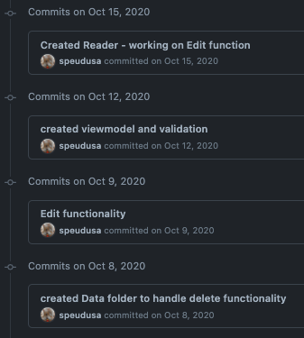

Repositories and Commits
=========================

.. index:: ! repository ! repo

.. _create-repo:

Create a Repository
-------------------

To get started with a git repository (or "repo" for short), the programmer must first create one.
To create a git repository, the programmer navigates to their project directory and uses the command ``git init``, like so:

.. sourcecode:: bash

   Students-Computer:~ student$ mkdir homework
   Students-Computer:~ student$ cd homework
   Students-Computer:homework student$ git init
      Initialized empty Git repository in /Users/student/homework/.git/

Now the programmer is ready to code away!

.. admonition:: Note

   This is an example of **local development** or creating repos and code bases on your own machine, that only you have access to.
   Local development allows you to create functional code that only your machine can deploy.  
   This is how we have been coding in this course so far.

Making Commits
--------------

After a while, the programmer has made a lot of changes and saved their code files many times over.  
It might be a good time to make a **commit** to their repository.  A commit is a record of changes you made to your repository.
It allows you to document your progress by creating a time-stamp with a message that you, or others, can reference.
When you look at a timeline of commits, you should be able to see the progress of development.

So when do they make a commit to their repository?

.. pull-quote::

   The general rule of thumb is that any time a significant change in functionality is made, a commit should be made.

If the programmer has created the Git repository and is ready to commit, they can do so by following the commit process.

.. note::

   Git does have a simple commit command, however, making a proper commit requires that the programmers follow a longer procedure than just one command.

The procedure for making a commit to a Git repository includes four stages.

1. ``git status`` gives the programmer information about files that have been changed.
2. ``git add`` allows the programmers to add specific or all changed files to a commit.
3. ``git commit -m MESSAGE`` creates the new commit with the files that the programmer added, with a message describing the changes included in the commit. Here, ``MESSAGE`` should be a descriptive message within double-quotes.
4. ``git log`` displays a log of every commit in the repository.

If the steps above are followed correctly, the programmer will find their latest commit at the top of the log.

Here is how the process will look in the terminal:

::

   Students-Computer:homework student$ git status
   On branch master

   Initial commit

   Untracked files:
     (use "git add <file>..." to include in what will be committed)

           learning-git.js

   nothing added to commit but untracked files present (use "git add" to track)
   Students-Computer:homework student$ git add .
   Students-Computer:homework student$ git commit -m "My first commit"
    [master (root-commit) 2c1e0af] My first commit
     1 file changed, 1 insertion(+)
     create mode 100644 learning-git.js
   Students-Computer:homework student$ git log
   commit 2c1e0af9467217d76c7e3c48bcf9389ceaa4714b
   Author: Student <lc101.student@email.com>
   Date:  Wed Apr 24 14:44:59 2019 -0500

       My first commit

To break down what happens in a commit even further:

When using ``git status``, the output shows two categories: modified tracked files and modified untracked files.
Modified tracked means that the file exists in the Git repository already, but is different than the version in the repository.
Modified untracked means that it is a new file that is not currently in the repository.

``git add`` adds files to the commit, but it does not commit those files.
By using ``git add .``, all the modified files were added to the commit.
If a programmer only wants to add one modified file, they can do so.

``git commit`` actually commits the files that were added to the repository.
By adding ``-m "My first commit"``, a comment was added to the commit.
This is helpful for looking through the log and seeing detailed comments of the changes made in each commit.

.. admonition:: Tip

   It's important to include a descriptive commit message. Such messages are visible in your local Git log, as well as in the commit history on GitHub. A good commit message allows you and your fellow developers to easily identify the changes made in a given commit.

``git log`` shows the author of the commit, the date made, the comment, and a 40-character hash.
This hash or value is a key for Git to refer to the version.
Programmers use these hashes to reference specific commits, or snapshots, in the repository's history.

Check Your Understanding
------------------------

.. admonition:: Question

   What git command is NOT a part of the commit process?

   #. ``git add``
   #. ``git log``
   #. ``git status``
   #. ``git push``
