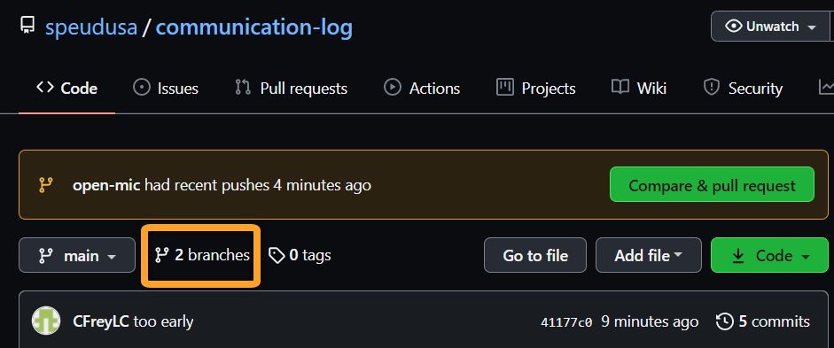

.. _studio-p2:

Studio: Communication Log (continued)
======================================

Congrats! You have successfully created a GitHub repo and started the collaboration process.  
The more you practice these steps, the easier and faster this process becomes.  

As we progress through the rest of the studio, you will be working with your partner in the same code base.
You will push and pull, you will create branches, and you might possibly merge your changes in and resolve possible merge conflicts.

Good luck!

.. admonition:: Tip 

   As you continue with the studio, you'll be working with *branches*.  

   It is very likely that you will make changes to the code only to realize 
   that you did so in the wrong branch.  When this happens (and it happens to us all)
   you cna use ``git stash`` to cleanly move your changes to another branch.

   Read about how to do this in our :ref:`Git Stash<git-stash>` tutorial.

Step 5: First Message Exchange
-------------------------------

#. **Pilot** We left off after you successfully cloned a copy of **Control's** repo onto your machine.
   Now you need to access the project.

   To access this project, you need to ``cd`` onto the level that contains the ``Project.cs``
   or ``.sln`` files.  This is the level you need to be at in order to ``push`` or ``pull`` changes.
   
   To open these files using the terminal CLI, type ``start *.sln`` in Windows, and ``open *.sln`` in Mac.

#. **Pilot** Modify the ``Program.cs`` file.  Add a new ``Console.WriteLine`` statement for your partner.  
   Be creative, the communication can go anywhere!  Just don't ask your partner what you should write.

#. **Pilot**: After you finish, save your changes and commit 
   them using the usual ``git status/git add ./git commit -m`` process.

#. **Pilot**: Once commited, ``push`` your changes up to GitHub so that **Control** can see them as well.
   Use the command:

   ::

      $ git push origin main
      Counting objects: 4, done.
      Delta compression using up to 4 threads.
      Compressing objects: 100% (4/4), done.
      Writing objects: 100% (4/4), 472 bytes | 472.00 KiB/s, done.
      Total 4 (delta 1), reused 0 (delta 0)
      remote: Resolving deltas: 100%, completed with 8 local objects.
      To git@github.com:username/communication-log.git
         511239a..679de77 main -> main

   .. admonition:: Tip

      Remember, the exact number of objects will vary based on your own changes.
      The key is to look at the commands and the final outcome.

      As we continue, we will pare down the examples to contain only the most useful data.

#. **Control**:  Pull **Pilots's** changes down from GitHub with the following command:

   ::

      $ git pull origin main
      remote: Enumerating objects: 7, done
      remote: Counting objects: 100% (7/7), done.
      remote: Compressing objects: 100% (3/3), done.
      remote: Total 4 (delta 1), reused 4 (delta 1), pack-reused 0
      Unpacking objects: 100% (4/4), 452 bytes | 37.00 KiB/s, done.
      From github.com:username/communication-log 
         * branch       main     -> FETCH_HEAD  
         e0de62d..e851b7e main   -> origin/main
      Updating e0de62d..e851b7e
      Fast-forward
      communication-log/Program.cs | 1 +
      1 file changed, 1 insertion(+)

#. **Control**: Notice that the code in your local ``Program.cs`` file now has **Pilot's** additions.  How cool is that!?!
   Go ahead and respond by adding a new ``Console.WriteLine`` message. Save your changes, then commit and push your changes up to GitHub.

#. **Pilot and Control**:  Play with the ``pull/edit/push`` process a few more times.  Repeat the cycle for a few more times to add to your story.  
   Be sure to run your program with each change to verify functionality.
   

Step 6: Create a Branch in Git
-------------------------------

This back-and-forth workflow is nice, but it can get in the way.
Afterall, professional developers don't sit around waiting for their 
teammates to commit and push a change before starting their own work.  
That could take forever as programs increase in size and function.
Fortunately, Git branches allow partners to work on a project at the
*same* time and at their own pace.

#. **Pilot**:  While **Control** is working on the next part of the story, use the terminal 
   to :ref:`create a new branch<new-branch>` called ``open-mic``.  
   Recall that a branch is a separate copy of the 
   codebase.  This lets you commit changes without affecting the code in the ``main`` branch.

   ::

      $ git checkout -b open-mic
      Switched to a new branch 'open-mic'

      $ git branch
      main
      * open-mic

   This command creates a new branch named ``open-mic``, and switches your local
   repository to use that branch.

#. **Pilot**: Copy and paste following code block *above* your ``Console.WriteLine`` stories.

   .. sourcecode:: csharp

      Console.WriteLine("Enter a number.");
      string input = Console.ReadLine();

      if(Int32.Parse(input) % 2 == 0)
      {
         Console.WriteLine("Your number is even");
      }
      else
      {
         Console.WriteLine("Your number is odd.");
      }

#. **Pilot**: Now save, stage, commit and push these changes.

   ::

      $ git add .
      $ git commit -m 'even or odd test added'
      . . .

      $ git push origin open-mic
      . . .
      To github.com:username/communication-log.git
      * [new branch] open-mic -> open-mic

   Note that the last command is a bit different than what we've used before
   (``git push origin main``). The final piece of this command is the name of
   the branch that we want to push to GitHub.

#. **Control**:  You will want to pull down the new ``open-mic`` branch. 
   The following command can help you do that:

   ::

      $ git pull origin open-mic

   .. admonition:: Tip
      
      If this is not working right away, the following steps can be used:
      
      #. Create a branch ``open-mic`` 

         ::

            $ git checkout -b open-mic
            $ git pull origin open-mic

      #. If you do not see any changes in your IDE, try closing your IDE and reopening it in your new branch.

      #. Still no changes?  Try the following:

         ::

            $ git pull 

         If git prompts you to use a specific command, use that command.
         For example:

         ::

            If you wish to set tracking information for this branch you do so with this:

               git branch --set-upstream-to=origin/<branch> open-mic

         With this command, replace the <branch> with the name of your branch.  In this example, they will match.

         ::

            $ git branch --set-upstream-to=origin/open-mic open-mic
            Branch 'open-mic' set up to track remote branch 'open-mic' from 'origin'

         Now you can pull down the latest changes from this branch.

   .. admonition:: Note

      If you don't know the name of the new branch, then just enter ``git pull``.  
      This will pull down *all* of the new branches and show you a list of the options.

#.  **Pilot and Control**:  If you haven't already done so, open ``Program.cs`` and see what it looks like.

Good!  Now let's take a look at GitHub and find the new ``open-mic`` branch.

View Branches in GitHub
^^^^^^^^^^^^^^^^^^^^^^^

**Control and Pilot**: On GitHub, you and your partner should both now see a second branch present on the project page. 
To view branches on GitHub, select *Branches* from the navigation
section just below the repository title (inside the bright orange rectangle).

   This is Control's view of GitHub.  A new box has popped out letting Control know that a Pull Request (PR) has been made.  

Great progress!  Now let's figure out how to merge these two branches in GitHub.

Step 7: Open a Pull Request in GitHub
-------------------------------------

#. **Pilot**: If you haven't already, in your browser, go to the GitHub project
   and click on *Branches* and make sure you see the new branch name, *open-mic*.

   .. figure:: figures/studio/pilot-branch-view.png
      :alt: The Branches page of a repo, with a button to open a new pull request to the right of each feature branch.
      :height: 300px

      Pilot's View of Branches Page in GitHub

#. **Pilot**: Click *New Pull Request* to begin the process of requesting that your changes
   in the ``open-mic`` branch be incorporated into the ``main`` branch. Add some
   text in the description box to let Control know what you did and why.

   .. admonition:: Note 
      
      The branch selected in the *base* dropdown is the one you want to
      merge *into*, while the selected branch in the *compare* dropdown is the one
      you want to merge *from*.

      .. figure:: figures/studio/pilot-merge-view.png
         :alt: The form for creating a new pull request with the dropdown boxes highlighted.
      
         Pilot's view for opening a PR, note the dropdown boxes

   This is what an opened pull request looks like:

   .. figure:: figures/studio/merge-pr.png
      :alt: An open pull request.
      :height: 500px

      An open PR in GitHub seen from Control's GitHub.  Should be similar in Pilot's GitHub.

Step 8: Merge the Pull Request
------------------------------

#. **Control**: Go to your repo in GitHub.  Click on *Pull Requests*.  
   Then click on the title for our one and only PR.

   .. figure:: figures/studio/control-pr-view.png
      :alt: View of the PR list, with the Pull requests circled and an arrow pointing at the newest PR.

      Control's view of an open PR in GitHub

#. **Control**: The page that opens shows the histroy of all the commits made to the ``open-mic`` branch.
   When ready, click the green *Merge Pull Request* button, followed by the *Confirm Merge*.

   .. figure:: figures/studio/control-merge-view.png
      :alt: Close up of the Merge request box showing no conflicts

      Control's view of the merge status.  Look! No conflicts!  

#. **Control**: If the merge went successfully, you should see a similar screen to the following:

   .. figure:: figures/studio/successful-merge-pilot-view.png
      :alt: View of a successful merge on the Pilot's GitHub

      Pilot's view of a successful merge.  Control you will see a similar screen.

#. **Pilot and Control**: The changes from ``open-mic`` are now in the ``main`` branch, 
   but only in the remote repository on GitHub.  
   You will need to pull the updates to your ``main`` for them to present locally.

   ::

      $ git checkout main
      $ git pull origin main

      . . .

      $ git status
      On branch main
      Your branch is up to date with 'origin/main'.

      nothing to commit, working tree clean

   Notice that the changes made in the ``open-mic`` branch now appear in ``main``.
   If your IDE doesn't change right away, try closing it then reopen it.
   
Congrats!  You successfully collaborated with a teammate to create a joined codebase. Great work!

Resources
---------

Before moving on to the bonus studio content, here are some external resources for using Git and GitHub.

* `Git Branching - Basic Branching and Merging <https://Git-scm.com/book/en/v2/Git-Branching-Basic-Branching-and-Merging>`_
* `Adding Another Person To Your Repository <https://help.Github.com/articles/inviting-collaborators-to-a-personal-repository/>`_
* `Resolving Conflicts In the Command Line <https://help.Github.com/articles/resolving-a-merge-conflict-using-the-command-line/>`_

Bonus: Merge Conflicts!
-----------------------

When collaborating on a project, things won't always go smoothly. It's common
for two people to make changes to the same line(s) of code, at roughly the same
time, which will prevent Git from being able to merge the changes together.

This will be similar to the chapter walkthrough, only now you have a teammate to work with.  
Our example here will be simple, since the chapter already covered this.

.. figure:: figures/studio/git-merge.gif
   :alt: An animated GIF file showing two opposing armies colliding in a mess

   Git Merge Conflicts

Merge conflicts often occur, and they are not a big deal. 
To see how to handle this situation, you will intentionally create a 
merge conflict and then resolve it like we did in the chapter.

#. **Pilot**: If you have not already, switch back to the ``main`` branch.

#. **Pilot**:  Above the Even or Odd check, update the text color.

   .. sourcecode:: csharp

      Console.ForegroundColor = ConsoleColor.Red;

#.  **Pilot**:  Save, stage and commit your changes then push them up to GitHub.

Meanwhile...

#. **Control**: Let's change the text color in ``main``.  It's pretty plain.  
   Commit your changes to branch ``main``.

   .. sourcecode:: csharp

      Console.ForegroundColor = ConsoleColor.Blue;

Resolving Merge Conflicts
^^^^^^^^^^^^^^^^^^^^^^^^^^^

#. **Control**: Try to push your changes up to GitHub. You should get an error message. How exciting!

   ::

      $ git push origin main

      To git@github.com:username/communication-log.git
      ! [rejected]        main -> main (fetch first)
      error: failed to push some refs to 'git@github.com:username/communication-log.git'
      hint: Updates were rejected because the remote contains work that you do
      hint: not have locally. This is usually caused by another repository pushing
      hint: to the same ref. You may want to first integrate the remote changes
      hint: (e.g., 'git pull ...') before pushing again.
      hint: See the 'Note about fast-forwards' in 'git push --help' for details.

   There is a lot of text in this message.
   However, the main idea is clear:  ``Updates were rejected because the remote contains work you do not have locally.``

#. **Control**: Somebody (**Pilot**, in this case), pushed changes to ``main``, and you don't have those commits on your computer.
   To fix this, begin my pulling those changes down from GitHub:

   Let's pull these outstanding changes into our branch and resolve the errors.

   ::

      $ git pull
      . . .
      Auto-merging communication-log.sln
      CONFLICT (content): Merge conflict in communication-log.sln
      Automatic merge failed; fix conflicts and then commit the result.

   Since **Pilot** and **Control** made changes to some of the same lines of code, Git cannot automatically merge the changes.  

#. **Control**: The specific locations where Git could not automatically merge files are
   indicated by the lines that begin with ``CONFLICT``. You will have to edit
   these files yourself and decide which changes to incorporate. 

   .. figure:: figures/studio/merge-conflict-control.png
      :alt: VS shows merge conflicts in the editor window

      Merge conflicts in ``main`` branch of communication-log, viewed in VS on a Windows.  Mac users, you will see a different screen, but the ``<<<<<<<``,  ``=======`` and ``>>>>>>>`` symbols will be the same.

   At the top and bottom of the codebase, we have some code that could be merged without issue.

   The code in conflict will be surrounded by the following symbols:

   - The code between ``<<<<<<< HEAD`` and ``=======`` symbols is the version of the code that exists locally for you. 
      These are *your* changes.

   - The code between ``=======`` and ``>>>>>>> 73f0189...`` are the changes that were made remotely.
      This is the code that **Pilot** made.  
      The hash ``73f0189...`` will be unique to the commit, so you'll see something slightly different on your screen.

#. **Control**: Select which changes you would like to keep, or if possible select all of them.  
   It's up to you and your partner.  However, you need to tell git which version to keep.
   You can use the provided editing buttons in your IDE to either ``Accept Current Change`` (your code),
   ``Accept Incoming Change`` (from **Pilot**), or update the code in question directly in the editor.
   The choice is yours!

#. **Control**: Save, commit, and push your changes.  You should see no error messages at this time.

#. **Pilot**:  Pull down the new updates.  Notice that since **Control** dealt with the merge conflicts, you don't have to.

Congratulations!  You just fixed your first collaborative merge conflict!  

More Merge Conflicts!
^^^^^^^^^^^^^^^^^^^^^^

Let's turn the tables on the steps we just carried out, so **Pilot** can practice
resolving merge conflicts.  Changing color is a great and simple place to start.

#. **Control and Pilot**: 
   Confer to determine the particular lines in the code
   that you will both change. Make different changes in those places.

#. **Control**: Stage, commit, and push your changes.

#. **Pilot**: Try to pull in Control's changes, and notice that there are merge
   conflicts. Resolve these conflicts as we did above (ask Control for help, if
   you're uncertain about the process). Then stage, commit, and push your
   changes.

#. **Control**: 
   Pull in the changes that Pilot pushed, including the resolved
   merge conflicts.

Merge conflicts are a part of the process of team development. Resolve them
carefully in order to avoid bugs in your code.

Avoiding Conflicts
^^^^^^^^^^^^^^^^^^

Git happens. Merge conflicts will pop up, but they're not a big deal. Still, the best way to handle them is to try to avoid them in the first place. Here are some tips:

#. Deal with any uncommitted work before trying to merge.
#. Partners should avoid working on the same file at the same time.
#. Try to avoid adding code directly into main. New ideas should be explored in a different branch first and then merged.

