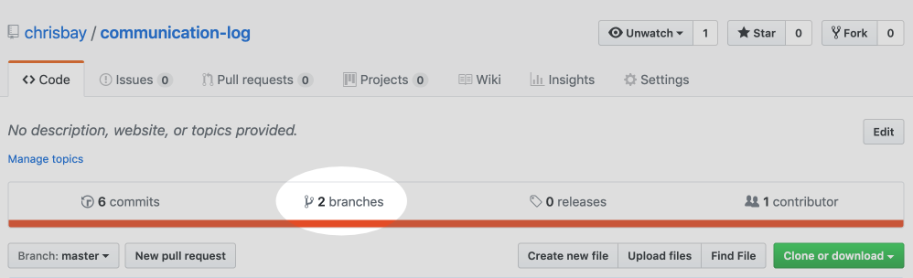
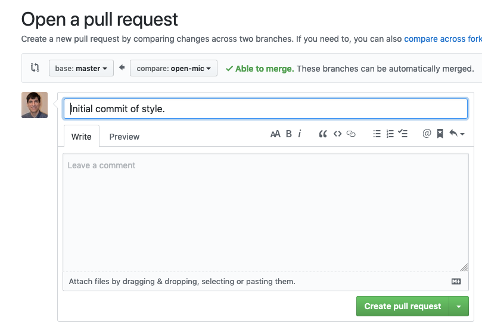

.. _studio-p2:

Studio: Communication Log (continued)
======================================

Congrats! You have successfully created a GitHub repo and started the collaboration process.  
The more you practice these steps, the easier and faster this process becomes.  

As we progress through the rest of the studio, you will be working with your partner in the same code base.
You will push and pull, you will create branches, and you might possibly merge your changes in and resolve possible merge conflicts.

Good luck!

.. admonition:: Warning

   As you go through these steps, you'll be working with branches. It's very
   likely you will make changes to the code only to realize that you did so in the
   wrong branch. When this happens (and it happens to all of us) you can use
   ``Git stash`` to cleanly move your changes to another branch. Read about how
   to do so in our :ref:`git-stash` tutorial.

Step 7: Pull Pilot's Line and Add Another Line
^^^^^^^^^^^^^^^^^^^^^^^^^^^^^^^^^^^^^^^^^^^^^^^

**Control**: You might notice you don't have the second line of code in your
copy of the project on your computer. Let's fix that. Go to the terminal and
enter this command to pull down the updated code into your local git
repository.

::

   $ git pull origin main
   remote: Counting objects: 3, done.
   remote: Compressing objects: 100% (2/2), done.
   remote: Total 3 (delta 1), reused 3 (delta 1), pack-reused 0
   Unpacking objects: 100% (3/3), done.
   From github.com:chrisbay/communication-log
      e0de62d..e851b7e  main     -> origin/main
   Updating e0de62d..e851b7e
   Fast-forward
   communication-log.sln | 1 +
   1 file changed, 1 insertion(+)

Now, in your editor, add a third line to the communication. Then add, commit,
and push it up.

You can have your story go anywhere! Try to tie it in with what the pilot
wrote, without discussing with them any plans on where the story will go.

Step 8: Do It Again: Pull, Change, and Push!
^^^^^^^^^^^^^^^^^^^^^^^^^^^^^^^^^^^^^^^^^^^^^

**Pilot**: You might notice now *you* don't have the third line on your
computer. Go to the terminal and enter this command to pull in the changes that
Control just made.

::

   $ git pull origin main
   remote: Counting objects: 3, done.
   remote: Compressing objects: 100% (2/2), done.
   remote: Total 3 (delta 1), reused 3 (delta 1), pack-reused 0
   Unpacking objects: 100% (3/3), done.
   From github.com:chrisbay/communication-log
      e851b7e..167684c  main     -> origin/main
   Updating e851b7e..167684c
   Fast-forward
   communication-log.sln | 1 +
   1 file changed, 1 insertion(+)

Now add a fourth line to the log. Again, be creative, but no planning!

Then add, commit, and push your change.

You can both play like this for a while! Feel free to repeat this cycle a few
times to add to the story.

Step 9: Create a Branch In Git
^^^^^^^^^^^^^^^^^^^^^^^^^^^^^^^

This workflow is a common one in team development situations. You might wonder,
however, if professional developers sit around waiting for their teammates to
commit and push a change before embarking on additional work on their own. That
would be a drag, and thankfully, there is a nice addition to this workflow that
will allow for simultaneous work to be carried out in a reasonable way.

**Pilot**: While Control is working on an addition to the story, let's make
another change simultaneously. In order to do that, we'll create a new branch.
Recall that a branch is a separate "copy" of the codebase that you can commit
to without affecting code in the ``main`` branch.

::

   $ git checkout -b open-mic
   Switched to a new branch 'open-mic'

This command creates a new branch named ``open-mic``, and switches your local
repository to use that branch.

Update the `background color of the console <https://docs.microsoft.com/en-us/dotnet/api/system.console.backgroundcolor?view=net-5.0>`_, and update the ``Hello World!`` statement to something more exciting.:

.. sourcecode:: csharp
   :linenos:

   Console.BackgroundColor = ConsoleColor.Your-Choice-Here

Now stage and commit these changes.

::

   $ git add .
   $ git commit -m 'Changed background color'
   $ git push origin open-mic

Note that the last command is a bit different than what we've used before
(``git push origin main``). The final piece of this command is the name of
the branch that we want to push to GitHub.

You and your partner should both now see a second branch present on the GitHub
project page. To view branches on GitHub, select *Branches* from the navigation
section just below the repository title.

   Branches Button in GitHub

In your terminal, you can type this command to see a list of the available
branches:

::

   $ git branch
   * open-mic
   main

Note that creating and being able to see a branch in your local repository via
this command does NOT mean that the branch is on GitHub. You'll need to push
the branch for it to appear on GitHub.

.. note::

   The \* to the left of ``open-mic`` indicates that this is the active branch.

Great! Now let's show the other player your work in GitHub and ask them to
merge it in to the main branch.

Create a Pull Request In GitHub
^^^^^^^^^^^^^^^^^^^^^^^^^^^^^^^^

**Pilot**: If you haven't already, in your browser, go to the GitHub project
and click on *Branches* and make sure you see the new branch name, *open-mic*.

.. figure:: figures/studio/new-pr-button.png
   :alt: The Branches page of a repo, with a button to open a new pull request to the right of each feature branch.
   :height: 300px

   Branches Page in GitHub

Click *New Pull Request* to begin the process of requesting that your changes
in the ``open-mic`` branch be incorporated into the ``main`` branch. Add some
text in the description box to let Control know what you did and why.

Note that the branch selected in the *base* dropdown is the one you want to
merge *into*, while the selected branch in the *compare* dropdown is the one
you want to merge *from*.

   Open a PR in GitHub

This is what an opened pull request looks like:

.. figure:: figures/studio/open-pr.png
   :alt: An open pull request.
   :height: 500px

   An open PR in GitHub

Step 10: Make a Change in the New Branch
^^^^^^^^^^^^^^^^^^^^^^^^^^^^^^^^^^^^^^^^^

**Control**: You will notice that you do not see the new console colors. 
Type this command to see what branches are on your local computer:

::

   $ git branch
   * main

If you want to work with the branch before merging it in, you can do so by
typing these commands:

::

   $ git fetch origin open-mic
   ...
   $ git branch
   open-mic
   * main

::

   $ git checkout open-mic
   Switched to branch 'open-mic'
   Your branch is up-to-date with 'origin/open-mic'.

Make a change, commit, and push this branch--you will see that the pull request
in GitHub is updated to reflect the changes you added. The context in the
description box is NOT updated, however, so be sure to add comments to the pull
request to explain what you did and why.

Now switch back to the ``main`` branch:

::

   $ git checkout main
   Switched to branch 'main'
   Your branch is up-to-date with 'origin/main'.

You will see your files no longer have the changes made in the ``open-mic``
branch. Let's go merge those changes in, so that the ``main`` branch adopts
all the changes in the ``open-mic`` branch.

Step 11: Merge the Pull Request
^^^^^^^^^^^^^^^^^^^^^^^^^^^^^^^^

**Control**: Go to the repo in GitHub. Click on *Pull Requests*.

.. figure:: figures/studio/pr-link.png

   PR Open in GitHub

Explore this page to see all the information GitHub shows you about the pull
request.

.. figure:: figures/studio/open-pr.png
   :alt: A pull request ready to merge
   :height: 500px

   Merge a Pull Request in GitHub

When you're happy with the changes, merge them in. Click *Merge Pull Request*
then *Confirm Merge*.

.. figure:: figures/studio/confirm-merge-pr.png
   :alt: Confirming a merge
   :height: 500px

   Confirm PR Merge in GitHub

Upon a successful merge, you should see a screen similar to the following:

.. figure:: figures/studio/pr-merged.png
   :alt: The screen displayed after a PR is merged
   :height: 500px

   PR Merged in GitHub

The changes from ``open-mic`` are now in the ``main`` branch, but only in
the remote repository on GitHub. You will need to pull the updates to your
``main`` for them to be present locally.

::

   $ git checkout main
   $ git pull origin main

Git is able to merge these files on its own.

Step 12: Merge Conflicts!
^^^^^^^^^^^^^^^^^^^^^^^^^^

When collaborating on a project, things won't always go smoothly. It's common
for two people to make changes to the same line(s) of code, at roughly the same
time, which will prevent Git from being able to merge the changes together.

.. figure:: figures/studio/git-merge.gif
   :alt: An animated GIF file showing two opposing armies colliding in a mess

   Git Merge Conflicts

This isn't such a big deal. In fact, it's very common. To see how we can handle
such a situation, we'll intentionally create a merge conflict and then resolve
it.

**Pilot**: Let's change something about the style file. Our Console is looking
pretty plain, so let's change the color and maybe share a joke or something to liven this up.

First, switch back to the ``main`` branch.

::

   $ git checkout main

Stage and commit your changes and push them up to GitHub. If you don't remember
how to do this, follow the instructions above. Make sure you're back in the
``main`` branch! If you're still in ``open-mic``, then your changes will be
isolated, and you won't get the merge conflict you need to learn about.

Meanwhile...

**Control**: Let's change something about the style file that Pilot just
edited. Change the color again.  
Update your current Console.WriteLine statement to make an observation about the weather or something.

Commit your changes to branch ``main``.

Step 13: Resolving Merge Conflicts
^^^^^^^^^^^^^^^^^^^^^^^^^^^^^^^^^^

**Control**: Try to push your changes up to GitHub. You should get an error
message. How exciting!

::

   $ git push origin main

   To git@github.com:chrisbay/communication-log.git
   ! [rejected]        main -> main (fetch first)
   error: failed to push some refs to 'git@github.com:chrisbay/communication-log.git'
   hint: Updates were rejected because the remote contains work that you do
   hint: not have locally. This is usually caused by another repository pushing
   hint: to the same ref. You may want to first integrate the remote changes
   hint: (e.g., 'git pull ...') before pushing again.
   hint: See the 'Note about fast-forwards' in 'git push --help' for details.

There's a lot of jargon in that message, including some terminology we haven't
encountered. However, the core of the message is indeed understandable to us:
"Updates were rejected because the remote contains work that you do not have
locally." In other words, somebody (Pilot, in this case), pushed changes to the
same branch, and you don't have those changes on your computer. Git will not
let you push to a branch in another repository unless you have incorporated all
of the work present in that branch.

Let's pull these outstanding changes into our branch and resolve the errors.

::

   $ git pull
   remote: Counting objects: 4, done.
   remote: Compressing objects: 100% (3/3), done.
   remote: Total 4 (delta 1), reused 4 (delta 1), pack-reused 0
   Unpacking objects: 100% (4/4), done.
   From github.com:chrisbay/communication-log
      7d7e42e..0c21659  main     -> origin/main
   Auto-merging communication-log.sln
   CONFLICT (content): Merge conflict in communication-log.sln
   Auto-merging communication-log.sln
   CONFLICT (content): Merge conflict in communication-log.sln
   Automatic merge failed; fix conflicts and then commit the result.

Since Pilot made changes to some of the same lines you did, Git was unable to
automatically merge the changes.

The specific locations where Git could not automatically merge files are
indicated by the lines that begin with ``CONFLICT``. You will have to edit
these files yourself to incorporate Pilot's changes. 

.. figure:: figures/studio/conflict-workspace.png
   :alt: VS shows merge conflicts in the editor window

   Merge conflicts in ``main`` branch of communication-log, viewed in VS on a Mac.  Windows users, you will see a different screen, but the ``<<<<<<<``,  ``=======`` and ``>>>>>>>`` symbols will be the same.

At the top and bottom, there is some code that could be merged without issue.

Between the ``<<<<<<< HEAD`` and ``=======`` symbols is the version of the code
that exists locally. These are *your* changes.

Between ``=======`` and ``>>>>>>> open-mic...``
are the changes that Pilot made (the hash ``open-mic...`` will be unique to
the commit, so you'll see something slightly different on your screen).

Let's unify our code.   Select which changes you would like to keep, or if possible select all of them.  It's up to you and your partner.

.. tip:: Like many other editors, VS provides fancy buttons to allow you to resolve individual merge conflicts with a single click. There's nothing magic about these buttons; they do the same thing that you can do by directly editing the file.

   Feel free to use them, but beware that they will not always work. If you need to incorporate parts of a change from both branches, you will need to manually edit the file to resolved the conflict.

Don't forget to stage and commit.

Step 14: Pulling the Merged Code
^^^^^^^^^^^^^^^^^^^^^^^^^^^^^^^^^

**Pilot**: Meanwhile, Pilot is sitting at home, minding their own business. A
random ``git status`` seems reassuring:

::

   $ git status
   On branch main
   Your branch is up-to-date with 'origin/main'.
   nothing to commit, working directory clean

Your local Git thinks the status is quo. Little does it know that up at GitHub,
the status is not quo. We'd find this out by doing either a ``git fetch``, or
if we just want the latest version of this branch, ``git pull``:

::

   $ git pull
   remote: Counting objects: 13, done.
   remote: Compressing objects: 100% (8/8), done.
   remote: Total 13 (delta 4), reused 13 (delta 4), pack-reused 0
   Unpacking objects: 100% (13/13), done.
   From Github.com:chrisbay/communication-log
      0c21659..e0de62d  main     -> origin/main
   Updating 0c21659..e0de62d
   Fast-forward
   communication-log.sln | 3 ++-
   1 file changed, 4 insertions(+), 3 deletions(-)

Great Scott! Looks like Control changed the ``communication-log``.
Note that *Pilot* didn't have to deal with the hassle of resolving merge
conflicts. Since Control intervened, Git assumes that the team is okay with the
way they resolved it, and *fast forwards* our local repo to be in sync with the
remote one. Let's look at ``communication-log.sln`` to make sure.  
What do you see?  What color is the text now?  Oh my!

Step 15: More Merge Conflicts!
^^^^^^^^^^^^^^^^^^^^^^^^^^^^^^^

Let's turn the tables on the steps we just carried out, so Pilot can practice
resolving merge conflicts.

#. **Control and Pilot**: Confer to determine the particular lines in the code
   that you will both change. Make different changes in those places.
#. **Control**: Stage, commit, and push your changes.
#. **Pilot**: Try to pull in Control's changes, and notice that there are merge
   conflicts. Resolve these conflicts as we did above (ask Control for help, if
   you're uncertain about the process). Then stage, commit, and push your
   changes.
#. **Control**: Pull in the changes that Pilot pushed, including the resolved
   merge conflicts.

Merge conflicts are a part of the process of team development. Resolve them
carefully in order to avoid bugs in your code.

Resources
^^^^^^^^^^

* `Git Branching - Basic Branching and Merging <https://Git-scm.com/book/en/v2/Git-Branching-Basic-Branching-and-Merging>`_
* `Adding Another Person To Your Repository <https://help.Github.com/articles/inviting-collaborators-to-a-personal-repository/>`_
* `Resolving Conflicts In the Command Line <https://help.Github.com/articles/resolving-a-merge-conflict-using-the-command-line/>`_

Step 7: Open a Pull Request in GitHub
-------------------------------------

#. **Pilot**: If you haven't already, in your browser, go to the GitHub project
   and click on *Branches* and make sure you see the new branch name, *open-mic*.

   .. figure:: figures/studio/pilot-branch-view.png
      :alt: The Branches page of a repo, with a button to open a new pull request to the right of each feature branch.
      :height: 300px

      Pilot's View of Branches Page in GitHub

#. **Pilot**: Click *New Pull Request* to begin the process of requesting that your changes
   in the ``open-mic`` branch be incorporated into the ``main`` branch. Add some
   text in the description box to let Control know what you did and why.

   .. admonition:: Note 
      
      The branch selected in the *base* dropdown is the one you want to
      merge *into*, while the selected branch in the *compare* dropdown is the one
      you want to merge *from*.

      .. figure:: figures/studio/pilot-merge-view.png
         :alt: The form for creating a new pull request with the dropdown boxes highlighted.
      
         Pilot's view for opening a PR, note the dropdown boxes

   This is what an opened pull request looks like:

   .. figure:: figures/studio/merge-pr.png
      :alt: An open pull request.
      :height: 500px

      An open PR in GitHub seen from Control's GitHub.  Should be similar in Pilot's GitHub.

Step 8: Merge the Pull Request
------------------------------

#. **Control**: Go to your repo in GitHub.  Click on *Pull Requests*.  
   Then click on the title for our one and only PR.

   .. figure:: figures/studio/control-pr-view.png
      :alt: View of the PR list, with the Pull requests circled and an arrow pointing at the newest PR.

      Control's view of an open PR in GitHub

#. **Control**: The page that opens shows the histroy of all the commits made to the ``open-mic`` branch.
   When ready, click the green *Merge Pull Request* button, followed by the *Confirm Merge*.

   .. figure:: figures/studio/control-merge-view.png
      :alt: Close up of the Merge request box showing no conflicts

      Control's view of the merge status.  Look! No conflicts!  

#. **Control**: If the merge went successfully, you should see a similar screen to the following:

   .. figure:: figures/studio/successful-merge-pilot-view.png
      :alt: View of a successful merge on the Pilot's GitHub

      Pilot's view of a successful merge.  Control you will see a similar screen.

#. **Pilot and Control**: The changes from ``open-mic`` are now in the ``main`` branch, 
   but only in the remote repository on GitHub.  
   You will need to pull the updates to your ``main`` for them to present locally.

   ::

      $ git checkout main
      $ git pull origin main

      . . .

      $ git status
      On branch main
      Your branch is up to date with 'origin/main'.

      nothing to commit, working tree clean

   Notice that the changes made in the ``open-mic`` branch now appear in ``main``.
   If your IDE doesn't change right away, try closing it then reopen it.
   
Congrats!  You successfully collaborated with a teammate to create a joined codebase. Great work!

Resources
---------

Before moving on to the bonus studio content, here are some external resources for using Git and GitHub.

* `Git Branching - Basic Branching and Merging <https://Git-scm.com/book/en/v2/Git-Branching-Basic-Branching-and-Merging>`_
* `Adding Another Person To Your Repository <https://help.Github.com/articles/inviting-collaborators-to-a-personal-repository/>`_
* `Resolving Conflicts In the Command Line <https://help.Github.com/articles/resolving-a-merge-conflict-using-the-command-line/>`_

Bonus: Merge Conflicts!
-----------------------

When collaborating on a project, things won't always go smoothly. It's common
for two people to make changes to the same line(s) of code, at roughly the same
time, which will prevent Git from being able to merge the changes together.

This will be similar to the chapter walkthrough, only now you have a teammate to work with.  
Our example here will be simple, since the chapter already covered this.

.. figure:: figures/studio/git-merge.gif
   :alt: An animated GIF file showing two opposing armies colliding in a mess

   Git Merge Conflicts

Merge conflicts often occur, and they are not a big deal. 
To see how to handle this situation, you will intentionally create a 
merge conflict and then resolve it like we did in the chapter.

#. **Pilot**: If you have not already, switch back to the ``main`` branch.

#. **Pilot**:  Above the Even or Odd check, update the text color.

   .. sourcecode:: csharp

      Console.ForegroundColor = ConsoleColor.Red;

#.  **Pilot**:  Save, stage and commit your changes then push them up to GitHub.

Meanwhile...

#. **Control**: Let's change the text color in ``main``.  It's pretty plain.  
   Commit your changes to branch ``main``.

   .. sourcecode:: csharp

      Console.ForegroundColor = ConsoleColor.Blue;

Resolving Merge Conflicts
^^^^^^^^^^^^^^^^^^^^^^^^^^^

#. **Control**: Try to push your changes up to GitHub. You should get an error message. How exciting!

   ::

      $ git push origin main

      To git@github.com:username/communication-log.git
      ! [rejected]        main -> main (fetch first)
      error: failed to push some refs to 'git@github.com:username/communication-log.git'
      hint: Updates were rejected because the remote contains work that you do
      hint: not have locally. This is usually caused by another repository pushing
      hint: to the same ref. You may want to first integrate the remote changes
      hint: (e.g., 'git pull ...') before pushing again.
      hint: See the 'Note about fast-forwards' in 'git push --help' for details.

   There is a lot of text in this message.
   However, the main idea is clear:  ``Updates were rejected because the remote contains work you do not have locally.``

#. **Control**: Somebody (**Pilot**, in this case), pushed changes to ``main``, and you don't have those commits on your computer.
   To fix this, begin my pulling those changes down from GitHub:

   Let's pull these outstanding changes into our branch and resolve the errors.

   ::

      $ git pull
      . . .
      Auto-merging communication-log.sln
      CONFLICT (content): Merge conflict in communication-log.sln
      Automatic merge failed; fix conflicts and then commit the result.

   Since **Pilot** and **Control** made changes to some of the same lines of code, Git cannot automatically merge the changes.  

#. **Control**: The specific locations where Git could not automatically merge files are
   indicated by the lines that begin with ``CONFLICT``. You will have to edit
   these files yourself and decide which changes to incorporate. 

   .. figure:: figures/studio/merge-conflict-control.png
      :alt: VS shows merge conflicts in the editor window

      Merge conflicts in ``main`` branch of communication-log, viewed in VS on a Windows.  Mac users, you will see a different screen, but the ``<<<<<<<``,  ``=======`` and ``>>>>>>>`` symbols will be the same.

   At the top and bottom of the codebase, we have some code that could be merged without issue.

   The code in conflict will be surrounded by the following symbols:

   - The code between ``<<<<<<< HEAD`` and ``=======`` symbols is the version of the code that exists locally for you. 
      These are *your* changes.

   - The code between ``=======`` and ``>>>>>>> 73f0189...`` are the changes that were made remotely.
      This is the code that **Pilot** made.  
      The hash ``73f0189...`` will be unique to the commit, so you'll see something slightly different on your screen.

#. **Control**: Select which changes you would like to keep, or if possible select all of them.  
   It's up to you and your partner.  However, you need to tell git which version to keep.
   You can use the provided editing buttons in your IDE to either ``Accept Current Change`` (your code),
   ``Accept Incoming Change`` (from **Pilot**), or update the code in question directly in the editor.
   The choice is yours!

#. **Control**: Save, commit, and push your changes.  You should see no error messages at this time.

#. **Pilot**:  Pull down the new updates.  Notice that since **Control** dealt with the merge conflicts, you don't have to.

Congratulations!  You just fixed your first collaborative merge conflict!  

More Merge Conflicts!
^^^^^^^^^^^^^^^^^^^^^^

Let's turn the tables on the steps we just carried out, so **Pilot** can practice
resolving merge conflicts.  Changing color is a great and simple place to start.

#. **Control and Pilot**: 
   Confer to determine the particular lines in the code
   that you will both change. Make different changes in those places.

#. **Control**: Stage, commit, and push your changes.

#. **Pilot**: Try to pull in Control's changes, and notice that there are merge
   conflicts. Resolve these conflicts as we did above (ask Control for help, if
   you're uncertain about the process). Then stage, commit, and push your
   changes.

#. **Control**: 
   Pull in the changes that Pilot pushed, including the resolved
   merge conflicts.

Merge conflicts are a part of the process of team development. Resolve them
carefully in order to avoid bugs in your code.

Avoiding Conflicts
^^^^^^^^^^^^^^^^^^

Git happens. Merge conflicts will pop up, but they're not a big deal. Still, the best way to handle them is to try to avoid them in the first place. Here are some tips:

#. Deal with any uncommitted work before trying to merge.
#. Partners should avoid working on the same file at the same time.
#. Try to avoid adding code directly into main. New ideas should be explored in a different branch first and then merged.

