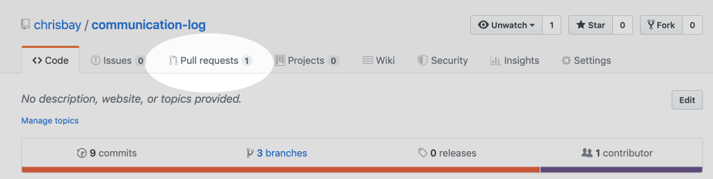

.. _studio-p2:

Studio: Communication Log (continued)
======================================

Congrats! You have successfully created a GitHub repo and started the collaboration process.  
The more you practice these steps, the easier and faster this process becomes.  

As we progress through the rest of the studio, you will be working with your partner in the same code base.
You will push and pull, you will create branches, and you might possibly merge your changes in and resolve possible merge conflicts.

Good luck!

.. admonition:: Warning

   As you go through these steps, you'll be working with branches. It's very
   likely you will make changes to the code only to realize that you did so in the
   wrong branch. When this happens (and it happens to all of us) you can use
   ``Git stash`` to cleanly move your changes to another branch. Read about how
   to do so in our :ref:`git-stash` tutorial.

Step 7: Pull Pilot's Line and Add Another Line
^^^^^^^^^^^^^^^^^^^^^^^^^^^^^^^^^^^^^^^^^^^^^^^

**Control**: You might notice you don't have the second line of code in your
copy of the project on your computer. Let's fix that. Go to the terminal and
enter this command to pull down the updated code into your local git
repository.

::

   $ git pull origin main
   remote: Counting objects: 3, done.
   remote: Compressing objects: 100% (2/2), done.
   remote: Total 3 (delta 1), reused 3 (delta 1), pack-reused 0
   Unpacking objects: 100% (3/3), done.
   From github.com:chrisbay/communication-log
      e0de62d..e851b7e  main     -> origin/main
   Updating e0de62d..e851b7e
   Fast-forward
   communication-log.sln | 1 +
   1 file changed, 1 insertion(+)

Now, in your editor, add a third line to the communication. Then add, commit,
and push it up.

You can have your story go anywhere! Try to tie it in with what the pilot
wrote, without discussing with them any plans on where the story will go.

Step 8: Do It Again: Pull, Change, and Push!
^^^^^^^^^^^^^^^^^^^^^^^^^^^^^^^^^^^^^^^^^^^^^

**Pilot**: You might notice now *you* don't have the third line on your
computer. Go to the terminal and enter this command to pull in the changes that
Control just made.

::

   $ git pull origin main
   remote: Counting objects: 3, done.
   remote: Compressing objects: 100% (2/2), done.
   remote: Total 3 (delta 1), reused 3 (delta 1), pack-reused 0
   Unpacking objects: 100% (3/3), done.
   From github.com:chrisbay/communication-log
      e851b7e..167684c  main     -> origin/main
   Updating e851b7e..167684c
   Fast-forward
   communication-log.sln | 1 +
   1 file changed, 1 insertion(+)

Now add a fourth line to the log. Again, be creative, but no planning!

Then add, commit, and push your change.

You can both play like this for a while! Feel free to repeat this cycle a few
times to add to the story.

Step 9: Create a Branch In Git
^^^^^^^^^^^^^^^^^^^^^^^^^^^^^^^

This workflow is a common one in team development situations. You might wonder,
however, if professional developers sit around waiting for their teammates to
commit and push a change before embarking on additional work on their own. That
would be a drag, and thankfully, there is a nice addition to this workflow that
will allow for simultaneous work to be carried out in a reasonable way.

**Pilot**: While Control is working on an addition to the story, let's make
another change simultaneously. In order to do that, we'll create a new branch.
Recall that a branch is a separate "copy" of the codebase that you can commit
to without affecting code in the ``main`` branch.

::

   $ git checkout -b open-mic
   Switched to a new branch 'open-mic'

This command creates a new branch named ``open-mic``, and switches your local
repository to use that branch.

Update the `background color of the console <https://docs.microsoft.com/en-us/dotnet/api/system.console.backgroundcolor?view=net-5.0>`_, and update the ``Hello World!`` statement to something more exciting.:

.. sourcecode:: csharp
   :linenos:

   Console.BackgroundColor = ConsoleColor.Your-Choice-Here

Now stage and commit these changes.

::

   $ git add .
   $ git commit -m 'Changed background color'
   $ git push origin open-mic

Note that the last command is a bit different than what we've used before
(``git push origin main``). The final piece of this command is the name of
the branch that we want to push to GitHub.

You and your partner should both now see a second branch present on the GitHub
project page. To view branches on GitHub, select *Branches* from the navigation
section just below the repository title.

.. figure:: figures/studio/two-branches.png

   Branches Button in GitHub

In your terminal, you can type this command to see a list of the available
branches:

::

   $ git branch
   * open-mic
   main

Note that creating and being able to see a branch in your local repository via
this command does NOT mean that the branch is on GitHub. You'll need to push
the branch for it to appear on GitHub.

.. note::

   The \* to the left of ``open-mic`` indicates that this is the active branch.

Great! Now let's show the other player your work in GitHub and ask them to
merge it in to the main branch.

Create a Pull Request In GitHub
^^^^^^^^^^^^^^^^^^^^^^^^^^^^^^^^

**Pilot**: If you haven't already, in your browser, go to the GitHub project
and click on *Branches* and make sure you see the new branch name, *open-mic*.

.. figure:: figures/studio/new-pr-button.png
   :alt: The Branches page of a repo, with a button to open a new pull request to the right of each feature branch.
   :height: 300px

   Branches Page in GitHub

Click *New Pull Request* to begin the process of requesting that your changes
in the ``open-mic`` branch be incorporated into the ``main`` branch. Add some
text in the description box to let Control know what you did and why.

Note that the branch selected in the *base* dropdown is the one you want to
merge *into*, while the selected branch in the *compare* dropdown is the one
you want to merge *from*.

.. figure:: figures/studio/create-pr.png
   :alt: The form for creating a new pull request.
   :height: 500px

   Open a PR in GitHub

This is what an opened pull request looks like:

.. figure:: figures/studio/open-pr.png
   :alt: An open pull request.
   :height: 500px

   An open PR in GitHub

Step 10: Make a Change in the New Branch
^^^^^^^^^^^^^^^^^^^^^^^^^^^^^^^^^^^^^^^^^

**Control**: You will notice that you do not see the new console colors. 
Type this command to see what branches are on your local computer:

::

   $ git branch
   * main

If you want to work with the branch before merging it in, you can do so by
typing these commands:

::

   $ git fetch origin open-mic
   ...
   $ git branch
   open-mic
   * main

::

   $ git checkout open-mic
   Switched to branch 'open-mic'
   Your branch is up-to-date with 'origin/open-mic'.

Make a change, commit, and push this branch--you will see that the pull request
in GitHub is updated to reflect the changes you added. The context in the
description box is NOT updated, however, so be sure to add comments to the pull
request to explain what you did and why.

Now switch back to the ``main`` branch:

::

   $ git checkout main
   Switched to branch 'main'
   Your branch is up-to-date with 'origin/main'.

You will see your files no longer have the changes made in the ``open-mic``
branch. Let's go merge those changes in, so that the ``main`` branch adopts
all the changes in the ``open-mic`` branch.

Step 11: Merge the Pull Request
^^^^^^^^^^^^^^^^^^^^^^^^^^^^^^^^

**Control**: Go to the repo in GitHub. Click on *Pull Requests*.

   PR Open in GitHub

Explore this page to see all the information GitHub shows you about the pull
request.

.. figure:: figures/studio/open-pr.png
   :alt: A pull request ready to merge
   :height: 500px

   Merge a Pull Request in GitHub

When you're happy with the changes, merge them in. Click *Merge Pull Request*
then *Confirm Merge*.

.. figure:: figures/studio/confirm-merge-pr.png
   :alt: Confirming a merge
   :height: 500px

   Confirm PR Merge in GitHub

Upon a successful merge, you should see a screen similar to the following:

.. figure:: figures/studio/pr-merged.png
   :alt: The screen displayed after a PR is merged
   :height: 500px

   PR Merged in GitHub

The changes from ``open-mic`` are now in the ``main`` branch, but only in
the remote repository on GitHub. You will need to pull the updates to your
``main`` for them to be present locally.

::

   $ git checkout main
   $ git pull origin main

Git is able to merge these files on its own.

Congrats! You successfully collaborated with a teammate to create a joined codebase. Great work!

Resources
^^^^^^^^^^

* `Git Branching - Basic Branching and Merging <https://Git-scm.com/book/en/v2/Git-Branching-Basic-Branching-and-Merging>`_
* `Adding Another Person To Your Repository <https://help.Github.com/articles/inviting-collaborators-to-a-personal-repository/>`_
* `Resolving Conflicts In the Command Line <https://help.Github.com/articles/resolving-a-merge-conflict-using-the-command-line/>`_

