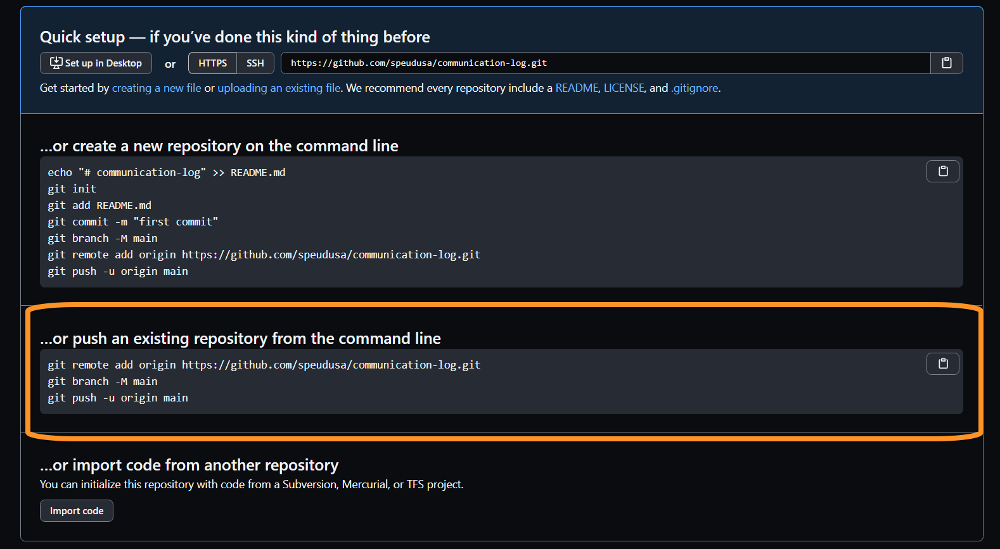
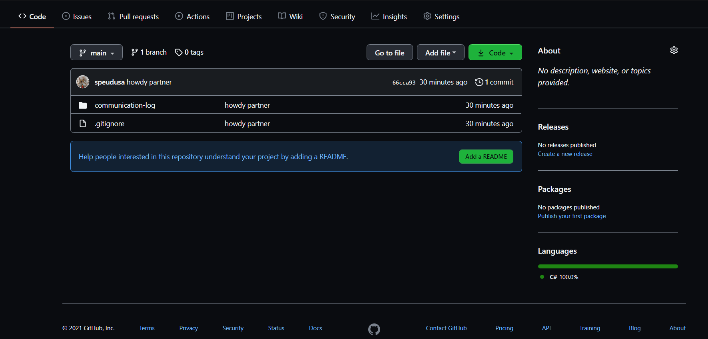

Studio: Communication Log
==========================

Code Together
-------------

Coding together allows you to work as a team so you can build bigger projects
faster.

In this studio, we will practice the common Git commands used when
multiple people work on the same code base.

You and a partner will begin by coding in tag-team shifts. By the end of the
task you should have a good idea about how to have two people work on the same
code at the same time. You will learn how to:

#. Quickly add code in pull + push cycles *(Important! This is the fundamental
   process!)*
#. Add a collaborator to a GitHub Project
#. Share *repositories* on GitHub
#. Create a *branch* in Git
#. Create a *pull request* in GitHub
#. Resolve merge conflicts (which are not as scary as they sound)

This lesson reinforces:

#. Creating repositories
#. Cloning repositories
#. Working with Git concepts: Staging, Commits, and Status

Overview
---------

The instructor will discuss why GitHub is worth learning. You already know how
to use a local Git repository with one branch, giving you the ability to move
your code forward and backward in time. Working with branches on GitHub extends
this ability by allowing multiple people to build different features at the
same time, then combine their work. Pull requests act as checkpoints when code
flows from branch to branch.

Students *must* pair off for this exercise. If you have trouble finding a
partner, ask your TA for help.

Getting Ready
--------------

You are going to simulate a radio conversation between a shuttle pilot and mission control.
You and your partner will alternate tasks, so decide who will be the **Pilot** and who will be **Control**.

Before you and your partner can begin your collaboration, some preparation is required first.
You will both start by creating a new repository on your separate GitHub accounts.

.. _create-new-git-repo:

Step 1: Create a New Local Repository
^^^^^^^^^^^^^^^^^^^^^^^^^^^^^^^^^^^^^^

.. admonition:: Note

   Be careful if you try to use ``copy/paste`` with the ``git`` commands! The
   ``$`` symbols in the screenshots represent to the prompts in the terminal.
   They are NOT part of the commands.

**Control and Pilot**: Both of you need to complete steps 1-8 on your own machines.

#. In the terminal, navigate to your development folder.  
   Enter the following 3 commands to create a new project.
   Replace ``-ROLE`` with your part in this studio, either ``-pilot`` or ``-control``.

   ::

      $ mkdir communication-log-ROLE
      $ cd communication-log-ROLE
      $ git init
      $ Initialized empty Git repository in [repo location on your machine]

   .. _diff-name:

   .. admonition:: Note

      **IMPORTANT:** To avoid confusion later, it is *critical* that you and your partner
      give different names to your repositories.

      For the remainder of this studio, we will refer to the repo as ``communication-log``.

#. Now that you have a directory, open Visual Studio and :ref:`create a new console project <create-new-csharp-project>`.  

   .. figure:: figures/studio/name-location-verControl.png
      :alt: Name your solution and select location for your files.
      
      Give your solution and project a name (1).  Typically they will have the same name.  Then select the directory to store your files (2).  Browse for the directory you just created.  

   .. admonition:: Setting Up a ``.gitignore`` File

      A ``.gitignore`` file, is a text file will contain untracked files, or ignored filed.
      These are files that will become part of your repo, but are not very useful to other developers.
      Placing them in a ``.gitignore`` file will tell git to skip over them, which will reduce visual clutter in your terminal.

 
      **Mac Users**: Note item 3 in the image above.  Check the boxes to use git for version control and create a ``.gitignore file``. 
   
      **Windows Users**: There are a few steps to create a ``.gitignore file``.

      #. Select the **Git** tab.  Scroll down to **Settings**.

         .. figure:: figures/studio/git-settings-tab.png
            :scale: 60%
            :alt: Select the Settings for Git in Visual Studio

      #. **Settings** will open the **Source Control** option.
         Under **Sorce Control** select **Git Repository Settings** then **General**
         in the right-side pane, look for the *Git files* section.
         Select **Add** for **Ignore file:**
         Select **OK** to add your new files.

         .. figure:: figures/studio/win-ignore-files.png
            :scale: 60%
            :alt: View of the General Git Repository Settins.

      Again, this is only one way to create this type of file.  
      Use it as a starting point, and grow from here.

#. Back in Visual Studio, in your ``Program.cs`` file, update the ``Console.WriteLine`` print Hello to your partner.
   Run it to make sure your updates are working.

   .. admonition:: Note

      If your console window does not stay open long enough for you to see your code, try adding the ``Console.Read()`` below the ``WriteLine``.
      This is a piece of code that will keep your terminal window open so you can read what it contains.
   
      If you can read your terminal window just fine and you haven't added anything, then ignore this tip.

   Now that you have updated your ``Program.cs`` file, be sure to save it. 

#. Return to the terminal, run a ``git status`` check.

   **Windows view after adding** ``.gitignore`` **file**
   
   ::

      $ git status
      On branch master

      No commits yet.

      Changes to be committed:
         (use "git rm --cached <file>..." to unstage)
         new file:   .gitignore
      
      Untracked files:
         (use "Git add <file>..." to include in what will be committed)
         communication-log/
         
      nothing added to commit but untracked files present (use "git add" to track)
   
   

   **Mac view after checking the boxes for Version Control and** ``.gitignore`` **files**

   ::

      $ git status
      On branch master

      No commits yet

      Untracked files:
      (use "git add <file>..." to include in what will be committed)

         communication-log/

      nothing added to commit but untracked files present (use "git add" to track)
   
   
   Go ahead and ``stage``, ``add``, and ``commit`` your new changes.  
   Remebmer you can use ``git add .`` to add all files to your commit.
   At this point, you can use the stand-alone terminal that you started with or switch over to the terminal within Visual Studio.  
   Your choice.  The output format may vary slightly between Windows, Mac, and Visual Studio terminals, but the commands and overall results will be the same.

#. First, check the ``status``.

   ::

      $ git status
      On branch master

      No commits yet.

      Untracked files:
      (use "Git add <file>..." to include in what will be committed)

         .gitignore
         communication-log.sln
         communication-log/Program.cs
         communication-log/communication-log.csproj

      nothing added to commit but untracked files present (use "git add" to track)

#. The output shows us that we have four new (untracked) files that have not been staged yet. Let's ``add``
   everything in this directory, then check the ``status`` again.

   ::

      $ git add .
      $ git status
      On branch master

      No commits yet

      Changes to be committed:
      (use "git rm --cached <file>..." to unstage)

         new file:  .gitignore
         new file:  communication-log.sln
         new file:  communication-log/Program.cs
         new file:  communication-log/communication-log.csproj

   .. admonition:: Note

      As noted earlier, output may vary across OS and terminals.  
      You may not see as may only see your main project folder listed rather than each file contained within it.
      Continue with your staging, adding, and committing process.  

      ::

         Untracked files"
            (Use "git add <file>..." to include what will be committed)
            communication-log/ 

#. The output tells us that the files are staged. Now let's ``commit``. After
   that, we can see a record of our progress by using ``git log``.

   ::

      $ git commit -m 'howdy partner'
      [master (root-commit) e1c1719] howdy partner
      4 files changed, 451 insertions(+)
      create mode 100644 .gitignore
      create mode 100644 communication-log.sln
      create mode 100644 communication-log/Program.cs
      create mode 100644 communication-log/communication-log.csproj

      $ git log
      commit 679de772612099c77891d2a3fab12af8db08b651
      Author: Courtney <launchcode@gmail.com>
      Date:   Mon Jul 25 10:55:56 2021 -0500

         howdy partner

   Great! We've got our project going locally, but we're going to need to make it
   accessible for your partner. The next step is to ``push`` this up to GitHub.

Before we move on to GitHub, double check the name of your default branch.
If it is not ``main``, this will be a good time to :ref:`change it<rename-branch>`.

.. admonition:: WARNING!

   If you do NOT change your default branch to ``main``, 
   linking your repo to GitHub will be a little more challenging.

Step 2: Push Your Repository To GitHub
^^^^^^^^^^^^^^^^^^^^^^^^^^^^^^^^^^^^^^^

**Control and Pilot**: Complete steps 1-5 on your separate devices and GitHub accounts.

#. Go to your GitHub profile in a web browser. Click on the "+"
   button to add a new repository (called a *repo* for short).

   .. figure:: figures/studio/new-repo-button.png
      :alt: The New Repository link in the dropdown menu at top right on GitHub.

      The *New Repository* link is in the dropdown menu at top right on GitHub.   

#. Create a new repository

   .. figure:: figures/studio/create-GH-repo.png
      :scale: 50%
      :alt: Creating a new repository in GitHub by filling out the form

   #. Fill in the name 
   #. Add a description if you want (completely optional). 
   #. For right now, keep your repo public and do NOT check any of the boxes asking about *README files*, *.gitignore* (you already did this), or *Choose a license*.
   #. Create your repository.

   .. admonition:: Note

      If you initialize with a README, in the next step Git will refuse to merge
      this repo with the local repo. There are ways around that, but it's faster
      and easier to just create an empty repo here.

#. After clicking, you should see something similar to:

   Connecting to a repository in GitHub

Now go back to your terminal and copy/paste the commands shown in the GitHub
instructions. These should be very similar to:

::

   $ git remote add origin https://github.com/username/communication-log.git
   $ git branch -M main
   $ git push -u origin main

.. index:: ! GitHub Initial Authentication, ! GitHub, ! git push  

**Initial Authentication**

The first time you push up to GitHub, you will be prompted in the terminal to enter your account username and password. Be sure to do this.

::

   $ git push -u origin main
   Username for 'https://github.com': your-username-here
   Passowrd for 'https://username@github.com': <type your password here>

.. admonition:: Note

   When entering your password, you will not see it.  
   In fact, it will look like nothing is happening.  
   This is not the case.  Type in your password, followed by *Enter* and your password will be accepted.
   (As long as you typed it correctly).

   For this inital step, your GitHub password is all that is being asked for.

   
You will then see a large amount of output that you can safely ignore. 
This output has information about the repo, but we don't need it at this time.

The final few lines will confirm a successful push. They will look something similar to this:

::

   To github.com:your-username/communication-log.git
      c7f97814..54993de3  main -> main

Now you should be able to confirm that GitHub has the same version as your
local project. (File contents in browser match those in terminal). Click around
and see what is there. You can read all your code through GitHub's web
interface.

   A repository with one commit and two items in GitHub

Git the Teamwork Started
-------------------------

You've successfully created a new GitHub repository and pushed content to it. 
Now it's time for you and your partner to start collaborating on the same repo.

For the remaining sections of this studio, keep an eye on the *Control* and *Pilot* role tags. 
Make sure that you both perform your tasks in the recommended order. 
Mixing things up won't destroy the universe, but it will make finishing the studio more complicated.

Even when it is not your turn to complete a task, read and observe what your partner is doing. 
The steps here mimic a real-world collaborative Git workflow.

Step 3: Add A Collaborator To A GitHub Project
^^^^^^^^^^^^^^^^^^^^^^^^^^^^^^^^^^^^^^^^^^^^^^

**Control**, the first step is yours.  
In order for **Pilot** to make changes to your GitHub repository, you must invite them to collaborate.

#. **Control**: In your web browser, go to your ``communication-log`` repo. 
   Click the *Settings* button then select the *Manage Access* option.

   .. figure:: figures/studio/manage-access.png
      :alt: Add a collaborator by typing their user name into the input on the Add Collaborator page.

      Add a collaborator to your repo in GitHub

#. **Control**: Click on the green *Invite a collaborator* button. 
   Enter your partner's GitHub username and click *Add to repository*.

   .. figure:: figures/studio/add-collab.png
      :scale: 60%
      :alt: Add a collaborator by typing their user name into the input on the Add Collaborator page.

      Choose who else can modify your GitHub repo.

#. **Pilot**: You should receive an email invitation to join this repository. 
   View and accept the invitation.

   .. admonition:: Note

      **Pilot:** If you don't see the email, check your Spam folder. 
      If you still don't have the email, login to your GitHub account. 
      Visit the URL for Control's copy of the repo. You should see an invite notification at the top of the page.

   .. _clone-from-git:

Step 4: Clone a Project from GitHub
^^^^^^^^^^^^^^^^^^^^^^^^^^^^^^^^^^^

.. admonition:: Warning

   **Pilot**, did you and your partner give :ref:`different names<diff-name>` to your 
   communication-log repositories?

   If not, take a moment to find your local communication-log folder on your machine. RENAME IT!

.. admonition:: Warning

   Unless you've set up an SSH key with GitHub, make sure you've selected the
   HTTPS clone URL. If you're not sure whether you have an SSH key, you
   probably don't.

#. **Pilot**: Go to Control's GitHub profile and find their ``communication-log`` repo.
   Click on the green *Code* button. Select HTTPS and copy the url to your clipboard.

   .. figure:: figures/studio/code-button.png
      :alt: The clone button is on the right-hand side of a project's main page

      Cloning a repository in GitHub

#. **Pilot** In your terminal, navigate to your directory and clone **Control's** repo.
   You should be OUTSIDE of any other Git repositories.

   The clone command should look something like this.

   ::
      
      Students-Computer: communication-log student$  git clone https://github.com/username/communication-log.git

   Replace the URL with the address you copied from GitHub.

.. admonition:: Note

   If you have created a personal access token, you may be asked to provide your username and password at this time.
   In this instance, the password that GitHub is looking for is your personal access token and not your GitHub password.

#. **Pilot**: You should now have a copy of **Control's** project on your own machine.
   
  
Git Talking
-------------

Whew! That was quite the setup expereience.  Now you're ready to dive into the main part of the assignment.

On to :ref:`Studio Part 2!<studio-p2>`

