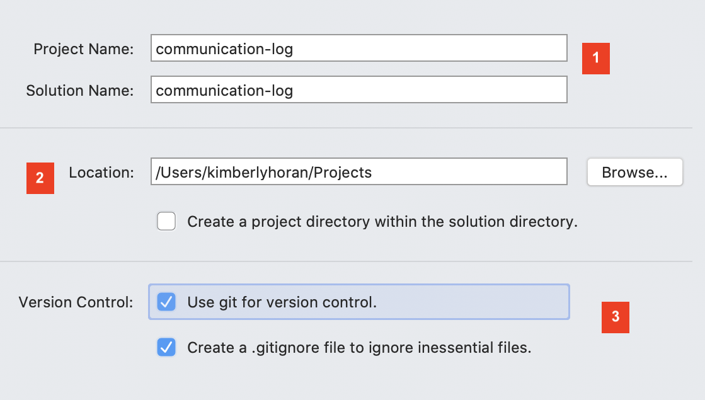
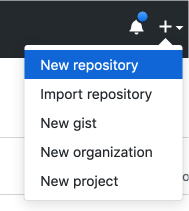

Studio: Communication Log
==========================

We are going to simulate a radio conversation between the shuttle pilot and
mission control.

First, find a new friend to share the activity.

You and your partner will alternate tasks, so designate one of you as **Pilot**
and the other as **Control**. Even when it is not your turn to complete a task,
read and observe what your partner is doing to complete theirs. The steps here
mimic how a real-world collaborative Git workflow can be used within a project.

.. admonition:: Warning

   As you go through these steps, you'll be working with branches. It's very
   likely you will make changes to the code only to realize that you did so in the
   wrong branch. When this happens (and it happens to all of us) you can use
   ``Git stash`` to cleanly move your changes to another branch. Read about how
   to do so in our :ref:`git-stash` tutorial.

.. _create-new-git-repo:

Step 1: Create a New Repository
^^^^^^^^^^^^^^^^^^^^^^^^^^^^^^^

.. admonition:: Note

   Be careful if you try to use ``copy/paste`` with the ``git`` commands! The
   ``$`` symbols in the screenshots represent to the prompts in the terminal.
   They are NOT part of the commands.

Windows instructions:
---------------------

**Control**: Navigate to your development folder and create a project folder.  
   Enter the following 3 commands to create a new project.
   
   ::

      $ cd communication-log
      $ git init
      $ Initialized empty Git repository in [repo location on your machine]

Now that you have a directory, open Visual Studio and :ref:`create a new console project <create-new-csharp-project>`.  

   .. figure:: figures/studio/name-location-verControl.png
      :alt: Name your solution and select location for your files.
      
      Give your solution and project a name (1).  Typically they will have the same name.  Then select the directory to store your files (2).  Browse for the directory you just created.  
      Open the terminal that is part of Visual Studio. It can be found under the **View** tab.

   .. admonition:: Setting Up a ``.gitignore`` File

      A ``.gitignore`` file, is a text file will contain untracked files, or ignored filed.
      These are files that will become part of your repo, but are not very useful to other developers.
      Placing them in a ``.gitignore`` file will tell git to skip over them, which will reduce visual clutter in your terminal.
   
      **Windows Users**: There are a few steps to create a ``.gitignore file``.

      #. Select the **Git** tab.  Scroll down to **Settings**.

         .. figure:: figures/studio/git-settings-tab.png
            :scale: 60%
            :alt: Select the Settings for Git in Visual Studio

      #. **Settings** will open the **Source Control** option.
         Under **Sorce Control** select **Git Repository Settings** then **General**
         in the right-side pane, look for the *Git files* section.
         Select **Add** for **Ignore file:**
         Select **OK** to add your new files.

         .. figure:: figures/studio/win-ignore-files.png
            :scale: 60%
            :alt: View of the General Git Repository Settins.

      Again, this is only one way to create this type of file.  
      Use it as a starting point, and grow from here.

Mac Instructions:
-----------------

**Control**: Open Visual Studio and :ref:`create a new project <create-new-csharp-project>`.  

   Give your solution and project a name (1).  Typically they will have the same name.  Then 
   select the directory to store your files (2). Lastly, check git for version control (3).

 **Mac Users**: Note item 3 in the image above.  Check the boxes to use git for version control and automatically create a ``.gitignore file``.

Step 2: Let's check that our project works by running it.
^^^^^^^^^^^^^^^^^^^^^^^^^^^^^^^^^^^^^^^^^^^^^^^^^^^^^^^^^

Open the terminal that is part of Visual Studio. It can be found under the **View** tab.

.. admonition:: Note

   If your console window does not stay open long enough for you to see your code, try adding the ``Console.Read()`` below the ``WriteLine``.
   This is a piece of code that will keep your terminal window open so you can read what it contains.
   
   If you can read your terminal window just fine and you haven't added anything, then ignore this tip.

Once you've checked this file in the terminal, let's stage and commit it.

#. First, check the ``status``.

   ::

      $ git status
      On branch main

      No commits yet.

      Untracked files:
      (use "Git add <file>..." to include in what will be committed)

         communication-log.sln
         communication-log/Program.cs
         communication-log/communication-log.csproj

      nothing added to commit but untracked files present (use "git add" to track)

#. The output shows us that we have three new files that have not been staged yet. Let's ``add``
   everything in this directory, then check the ``status`` again.

   ::

      $ git add .
      $ git status
      On branch main

      No commits yet

      Changes to be committed:
      (use "git rm --cached <file>..." to unstage)

         new file:  communication-log.sln
         new file:  communication-log/Program.cs
         new file:  communication-log/communication-log.csproj

#. The output tells us that the files are staged. Now let's ``commit``. After
   that, we can see a record of our progress by using ``git log``.

   ::

      $ git commit -m 'Started communication log.'
      [main (root-commit) e1c1719] Started communication log.
      4 files changed, 451 insertions(+)
      create mode 100644 .gitignore
      create mode 100644 communication-log.sln
      create mode 100644 communication-log/Program.cs
      create mode 100644 communication-log/communication-log.csproj

      $ git log
      commit 679de772612099c77891d2a3fab12af8db08b651
      Author: Cheryl <chrisbay@gmail.com>
      Date:   Wed Apr 5 10:55:56 2017 -0500

         Started communication log.

Great! We've got our project going locally, but we're going to need to make it
accessible for **Pilot** also. Let's push this project up to GitHub.

Step 3: Share Your Repository On GitHub
^^^^^^^^^^^^^^^^^^^^^^^^^^^^^^^^^^^^^^^

**Control**: Go to your GitHub profile in a web browser. Click on the "+"
button to add a new repository (called a *repo* for short).

   The *New Repository* link is in the dropdown menu at top right on GitHub.

To create a new repository:

#. Fill in the name and description. 
#. Uncheck *Initialize this repository with a README* and click *Create Repository*.

   Create a new repository in GitHub

.. admonition:: Note

   If you initialize with a README, in the next step Git will refuse to merge
   this repo with the local repo. There are ways around that, but it's faster
   and easier to just create an empty repo here.

After clicking, you should see something similar to:

.. figure:: figures/studio/new-repo-push-main.png
   :alt: The page you see after creating an empty repository, with several options.

   Connecting to a repository in GitHub

Now go back to your terminal and copy/paste the commands shown in the GitHub
instructions. These should be very similar to:

::

   $ git remote add origin https://github.com/your-username/communication-log.git
   $ git branch -M main
   $ git push -u origin main

.. admonition:: Note

   The first time you push up to GitHub, you will be prompted in the terminal
   to enter your account username and password. Do this.
   
   You will then see a large amount of output that you can safely ignore. The
   final few lines will confirm a successful push. They will look something
   like this:

   ::

      To github.com:your-username/communication-log.git
         c7f97814..54993de3  main -> main

   Notice that if your local branch was named ``master`` it was automatically changed to ``main``.

.. admonition:: Warning

   Unless you've set up an SSH key with GitHub, make sure you've selected the
   HTTPS clone URL. If you're not sure whether you have an SSH key, you
   probably don't.

Now you should be able to confirm that GitHub has the same version as your
local project. (File contents in browser match those in terminal). Click around
and see what is there. You can read all your code through GitHub's web
interface.

.. figure:: figures/studio/repo-first-commit.png
   :alt: A repository with one commit in GitHub

   A repository with one commit in GitHub

.. _clone-from-git:

Step 4: Clone a Project from GitHub
^^^^^^^^^^^^^^^^^^^^^^^^^^^^^^^^^^^

**Pilot**: Go to Control's GitHub profile and find the communication-log repo.
Click on the green *Clone or download* button. Use HTTPS (not SSH). Copy the
url to your clipboard.

.. figure:: figures/studio/clone-button.png
   :alt: The clone button is on the right-hand side of a project's main page

   Cloning a repository in GitHub

In your terminal, navigate to your development folder and clone down the repo.
The command should look something like this.

::

   $ git clone https://github.com/chrisbay/communication-log.git

Now you can respond to Control! Open the ``communication-log.sln`` file in your editor and
add your response to mission control. Be creative, the communication can go
anywhere! Just don't ask your partner what you should write. After you finish,
commit your change.

.. admonition:: Note

   When you open the project folder, you might not be in the same directory as the solution.  
   You want to open the solution or ``.sln`` file.  
   A quick way to do that from the terminal is to ``cd`` into the folder that is holding the solution and then type ``open .sln``.

::

   $ git status
   On branch main
   Your branch is up-to-date with 'origin/main'.
   nothing to commit, working directory clean
   $ git add .
   $ git commit -m 'Added second line to log.'

Now we need to push up your changes so Control can use them as well.

::

   $ git push origin main
   ERROR: Permission to chrisbay/communication-log.git denied to pilot.
   fatal: Could not read from remote repository.

   Please make sure you have the correct access rights
   and the repository exists.

Great error message! It let us know exactly what went wrong: Pilot does not
have security permissions to write to Control's repo. Let's fix that.

Step 5: Add A Collaborator To A GitHub Project
^^^^^^^^^^^^^^^^^^^^^^^^^^^^^^^^^^^^^^^^^^^^^^

**Control**: In your web browser, go to your ``communication-log`` repo. Click
the *Settings* button then click on *Collaborators*. Enter in Pilot's GitHub
username and click *Add Collaborator*.

.. figure:: figures/studio/add-collaborator.png
   :alt: Add a collaborator by typing their user name into the input on the Add Collaborator page.

   Add a collaborator to your repo in GitHub

Step 6: Join the Project and Push
^^^^^^^^^^^^^^^^^^^^^^^^^^^^^^^^^

**Pilot**: You should receive an email invitation to join this repository.
View and accept the invitation.

.. note::

   If you don't see an email (it may take a few minutes to arrive in your inbox),
   check your Spam folder. If you still don't have an email, visit the
   repository page for the repo that Control created (ask them for the link), and
   you'll see a notification at the top of the page.

.. figure:: figures/studio/repo-invite.png
   :alt: The email invite to join a GitHub repository
   :height: 400px

   Invited to collaborate email in GitHub

Now let's go enter that command again to push up our code.

::

   $ git push origin main
   Counting objects: 9, done.
   Delta compression using up to 4 threads.
   Compressing objects: 100% (9/9), done.
   Writing objects: 100% (9/9), 1.01 KiB | 0 bytes/s, done.
   Total 9 (delta 8), reused 0 (delta 0)
   remote: Resolving deltas: 100% (8/8), completed with 8 local objects.
   To git@github.com:chrisbay/communication-log.git
      511239a..679de77  main -> main

Anyone reading the code through GitHub's browser interface should now see the
new second line.

Step 7: Pull Pilot's Line and Add Another Line
^^^^^^^^^^^^^^^^^^^^^^^^^^^^^^^^^^^^^^^^^^^^^^^

**Control**: You might notice you don't have the second line of code in your
copy of the project on your computer. Let's fix that. Go to the terminal and
enter this command to pull down the updated code into your local git
repository.

::

   $ git pull origin main
   remote: Counting objects: 3, done.
   remote: Compressing objects: 100% (2/2), done.
   remote: Total 3 (delta 1), reused 3 (delta 1), pack-reused 0
   Unpacking objects: 100% (3/3), done.
   From github.com:chrisbay/communication-log
      e0de62d..e851b7e  main     -> origin/main
   Updating e0de62d..e851b7e
   Fast-forward
   communication-log.sln | 1 +
   1 file changed, 1 insertion(+)

Now, in your editor, add a third line to the communication. Then add, commit,
and push it up.

You can have your story go anywhere! Try to tie it in with what the pilot
wrote, without discussing with them any plans on where the story will go.

Step 8: Do It Again: Pull, Change, and Push!
^^^^^^^^^^^^^^^^^^^^^^^^^^^^^^^^^^^^^^^^^^^^^

**Pilot**: You might notice now *you* don't have the third line on your
computer. Go to the terminal and enter this command to pull in the changes that
Control just made.

::

   $ git pull origin main
   remote: Counting objects: 3, done.
   remote: Compressing objects: 100% (2/2), done.
   remote: Total 3 (delta 1), reused 3 (delta 1), pack-reused 0
   Unpacking objects: 100% (3/3), done.
   From github.com:chrisbay/communication-log
      e851b7e..167684c  main     -> origin/main
   Updating e851b7e..167684c
   Fast-forward
   communication-log.sln | 1 +
   1 file changed, 1 insertion(+)

Now add a fourth line to the log. Again, be creative, but no planning!

Then add, commit, and push your change.

You can both play like this for a while! Feel free to repeat this cycle a few
times to add to the story.

Step 9: Create a Branch In Git
^^^^^^^^^^^^^^^^^^^^^^^^^^^^^^^

This workflow is a common one in team development situations. You might wonder,
however, if professional developers sit around waiting for their teammates to
commit and push a change before embarking on additional work on their own. That
would be a drag, and thankfully, there is a nice addition to this workflow that
will allow for simultaneous work to be carried out in a reasonable way.

**Pilot**: While Control is working on an addition to the story, let's make
another change simultaneously. In order to do that, we'll create a new branch.
Recall that a branch is a separate "copy" of the codebase that you can commit
to without affecting code in the ``main`` branch.

::

   $ git checkout -b open-mic
   Switched to a new branch 'open-mic'

This command creates a new branch named ``open-mic``, and switches your local
repository to use that branch.

Update the `background color of the console <https://docs.microsoft.com/en-us/dotnet/api/system.console.backgroundcolor?view=net-5.0>`_, and update the ``Hello World!`` statement to something more exciting.:

.. sourcecode:: csharp
   :linenos:

   Console.BackgroundColor = ConsoleColor.Your-Choice-Here

Now stage and commit these changes.

::

   $ git add .
   $ git commit -m 'Changed background color'
   $ git push origin open-mic

Note that the last command is a bit different than what we've used before
(``git push origin main``). The final piece of this command is the name of
the branch that we want to push to GitHub.

You and your partner should both now see a second branch present on the GitHub
project page. To view branches on GitHub, select *Branches* from the navigation
section just below the repository title.

.. figure:: figures/studio/two-branches.png

   Branches Button in GitHub

In your terminal, you can type this command to see a list of the available
branches:

::

   $ git branch
   * open-mic
   main

Note that creating and being able to see a branch in your local repository via
this command does NOT mean that the branch is on GitHub. You'll need to push
the branch for it to appear on GitHub.

.. note::

   The \* to the left of ``open-mic`` indicates that this is the active branch.

Great! Now let's show the other player your work in GitHub and ask them to
merge it in to the main branch.

Create a Pull Request In GitHub
^^^^^^^^^^^^^^^^^^^^^^^^^^^^^^^^

**Pilot**: If you haven't already, in your browser, go to the GitHub project
and click on *Branches* and make sure you see the new branch name, *open-mic*.

.. figure:: figures/studio/new-pr-button.png
   :alt: The Branches page of a repo, with a button to open a new pull request to the right of each feature branch.
   :height: 300px

   Branches Page in GitHub

Click *New Pull Request* to begin the process of requesting that your changes
in the ``open-mic`` branch be incorporated into the ``main`` branch. Add some
text in the description box to let Control know what you did and why.

Note that the branch selected in the *base* dropdown is the one you want to
merge *into*, while the selected branch in the *compare* dropdown is the one
you want to merge *from*.

.. figure:: figures/studio/create-pr.png
   :alt: The form for creating a new pull request.
   :height: 500px

   Open a PR in GitHub

This is what an opened pull request looks like:

.. figure:: figures/studio/open-pr.png
   :alt: An open pull request.
   :height: 500px

   An open PR in GitHub

Step 10: Make a Change in the New Branch
^^^^^^^^^^^^^^^^^^^^^^^^^^^^^^^^^^^^^^^^^

**Control**: You will notice that you do not see the new console colors. 
Type this command to see what branches are on your local computer:

::

   $ git branch
   * main

If you want to work with the branch before merging it in, you can do so by
typing these commands:

::

   $ git fetch origin open-mic
   ...
   $ git branch
   open-mic
   * main

::

   $ git checkout open-mic
   Switched to branch 'open-mic'
   Your branch is up-to-date with 'origin/open-mic'.

Make a change, commit, and push this branch--you will see that the pull request
in GitHub is updated to reflect the changes you added. The context in the
description box is NOT updated, however, so be sure to add comments to the pull
request to explain what you did and why.

Now switch back to the ``main`` branch:

::

   $ git checkout main
   Switched to branch 'main'
   Your branch is up-to-date with 'origin/main'.

You will see your files no longer have the changes made in the ``open-mic``
branch. Let's go merge those changes in, so that the ``main`` branch adopts
all the changes in the ``open-mic`` branch.

Step 11: Merge the Pull Request
^^^^^^^^^^^^^^^^^^^^^^^^^^^^^^^^

**Control**: Go to the repo in GitHub. Click on *Pull Requests*.

.. figure:: figures/studio/pr-link.png

   PR Open in GitHub

Explore this page to see all the information GitHub shows you about the pull
request.

.. figure:: figures/studio/open-pr.png
   :alt: A pull request ready to merge
   :height: 500px

   Merge a Pull Request in GitHub

When you're happy with the changes, merge them in. Click *Merge Pull Request*
then *Confirm Merge*.

   Confirm PR Merge in GitHub

Upon a successful merge, you should see a screen similar to the following:

.. figure:: figures/studio/pr-merged.png
   :alt: The screen displayed after a PR is merged
   :height: 500px

   PR Merged in GitHub

The changes from ``open-mic`` are now in the ``main`` branch, but only in
the remote repository on GitHub. You will need to pull the updates to your
``main`` for them to be present locally.

::

   $ git checkout main
   $ git pull origin main

Git is able to merge these files on its own.

Step 12: Merge Conflicts!
^^^^^^^^^^^^^^^^^^^^^^^^^^

When collaborating on a project, things won't always go smoothly. It's common
for two people to make changes to the same line(s) of code, at roughly the same
time, which will prevent Git from being able to merge the changes together.

.. figure:: figures/studio/git-merge.gif
   :alt: An animated GIF file showing two opposing armies colliding in a mess

   Git Merge Conflicts

This isn't such a big deal. In fact, it's very common. To see how we can handle
such a situation, we'll intentionally create a merge conflict and then resolve
it.

**Pilot**: Let's change something about the style file. Our Console is looking
pretty plain, so let's change the color and maybe share a joke or something to liven this up.

First, switch back to the ``main`` branch.

::

   $ git checkout main

Stage and commit your changes and push them up to GitHub. If you don't remember
how to do this, follow the instructions above. Make sure you're back in the
``main`` branch! If you're still in ``open-mic``, then your changes will be
isolated, and you won't get the merge conflict you need to learn about.

Meanwhile...

**Control**: Let's change something about the style file that Pilot just
edited. Change the color again.  
Update your current Console.WriteLine statement to make an observation about the weather or something.

Commit your changes to branch ``main``.

Step 13: Resolving Merge Conflicts
^^^^^^^^^^^^^^^^^^^^^^^^^^^^^^^^^^

**Control**: Try to push your changes up to GitHub. You should get an error
message. How exciting!

::

   $ git push origin main

   To git@github.com:chrisbay/communication-log.git
   ! [rejected]        main -> main (fetch first)
   error: failed to push some refs to 'git@github.com:chrisbay/communication-log.git'
   hint: Updates were rejected because the remote contains work that you do
   hint: not have locally. This is usually caused by another repository pushing
   hint: to the same ref. You may want to first integrate the remote changes
   hint: (e.g., 'git pull ...') before pushing again.
   hint: See the 'Note about fast-forwards' in 'git push --help' for details.

There's a lot of jargon in that message, including some terminology we haven't
encountered. However, the core of the message is indeed understandable to us:
"Updates were rejected because the remote contains work that you do not have
locally." In other words, somebody (Pilot, in this case), pushed changes to the
same branch, and you don't have those changes on your computer. Git will not
let you push to a branch in another repository unless you have incorporated all
of the work present in that branch.

Let's pull these outstanding changes into our branch and resolve the errors.

::

   $ git pull
   remote: Counting objects: 4, done.
   remote: Compressing objects: 100% (3/3), done.
   remote: Total 4 (delta 1), reused 4 (delta 1), pack-reused 0
   Unpacking objects: 100% (4/4), done.
   From github.com:chrisbay/communication-log
      7d7e42e..0c21659  main     -> origin/main
   Auto-merging communication-log.sln
   CONFLICT (content): Merge conflict in communication-log.sln
   Auto-merging communication-log.sln
   CONFLICT (content): Merge conflict in communication-log.sln
   Automatic merge failed; fix conflicts and then commit the result.

Since Pilot made changes to some of the same lines you did, Git was unable to
automatically merge the changes.

The specific locations where Git could not automatically merge files are
indicated by the lines that begin with ``CONFLICT``. You will have to edit
these files yourself to incorporate Pilot's changes. 

.. figure:: figures/studio/conflict-workspace.png
   :alt: VS shows merge conflicts in the editor window

   Merge conflicts in ``main`` branch of communication-log, viewed in VS on a Mac.  Windows users, you will see a different screen, but the ``<<<<<<<``,  ``=======`` and ``>>>>>>>`` symbols will be the same.

At the top and bottom, there is some code that could be merged without issue.

Between the ``<<<<<<< HEAD`` and ``=======`` symbols is the version of the code
that exists locally. These are *your* changes.

Between ``=======`` and ``>>>>>>> open-mic...``
are the changes that Pilot made (the hash ``open-mic...`` will be unique to
the commit, so you'll see something slightly different on your screen).

Let's unify our code.   Select which changes you would like to keep, or if possible select all of them.  It's up to you and your partner.

.. tip:: Like many other editors, VS provides fancy buttons to allow you to resolve individual merge conflicts with a single click. There's nothing magic about these buttons; they do the same thing that you can do by directly editing the file.

   Feel free to use them, but beware that they will not always work. If you need to incorporate parts of a change from both branches, you will need to manually edit the file to resolved the conflict.

Don't forget to stage and commit.

Step 14: Pulling the Merged Code
^^^^^^^^^^^^^^^^^^^^^^^^^^^^^^^^^

**Pilot**: Meanwhile, Pilot is sitting at home, minding their own business. A
random ``git status`` seems reassuring:

::

   $ git status
   On branch main
   Your branch is up-to-date with 'origin/main'.
   nothing to commit, working directory clean

Your local Git thinks the status is quo. Little does it know that up at GitHub,
the status is not quo. We'd find this out by doing either a ``git fetch``, or
if we just want the latest version of this branch, ``git pull``:

::

   $ git pull
   remote: Counting objects: 13, done.
   remote: Compressing objects: 100% (8/8), done.
   remote: Total 13 (delta 4), reused 13 (delta 4), pack-reused 0
   Unpacking objects: 100% (13/13), done.
   From Github.com:chrisbay/communication-log
      0c21659..e0de62d  main     -> origin/main
   Updating 0c21659..e0de62d
   Fast-forward
   communication-log.sln | 3 ++-
   1 file changed, 4 insertions(+), 3 deletions(-)

Great Scott! Looks like Control changed the ``communication-log``.
Note that *Pilot* didn't have to deal with the hassle of resolving merge
conflicts. Since Control intervened, Git assumes that the team is okay with the
way they resolved it, and *fast forwards* our local repo to be in sync with the
remote one. Let's look at ``communication-log.sln`` to make sure.  
What do you see?  What color is the text now?  Oh my!

Step 15: More Merge Conflicts!
^^^^^^^^^^^^^^^^^^^^^^^^^^^^^^^

Let's turn the tables on the steps we just carried out, so Pilot can practice
resolving merge conflicts.

#. **Control and Pilot**: Confer to determine the particular lines in the code
   that you will both change. Make different changes in those places.
#. **Control**: Stage, commit, and push your changes.
#. **Pilot**: Try to pull in Control's changes, and notice that there are merge
   conflicts. Resolve these conflicts as we did above (ask Control for help, if
   you're uncertain about the process). Then stage, commit, and push your
   changes.
#. **Control**: Pull in the changes that Pilot pushed, including the resolved
   merge conflicts.

Merge conflicts are a part of the process of team development. Resolve them
carefully in order to avoid bugs in your code.

Resources
^^^^^^^^^^

* `Git Branching - Basic Branching and Merging <https://Git-scm.com/book/en/v2/Git-Branching-Basic-Branching-and-Merging>`_
* `Adding Another Person To Your Repository <https://help.Github.com/articles/inviting-collaborators-to-a-personal-repository/>`_
* `Resolving Conflicts In the Command Line <https://help.Github.com/articles/resolving-a-merge-conflict-using-the-command-line/>`_
