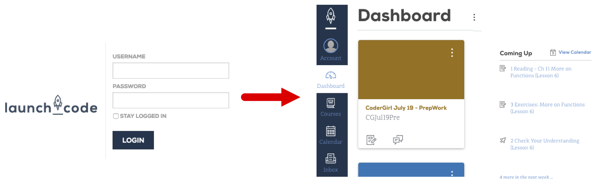
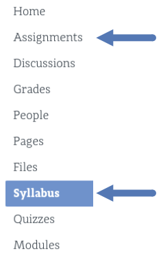
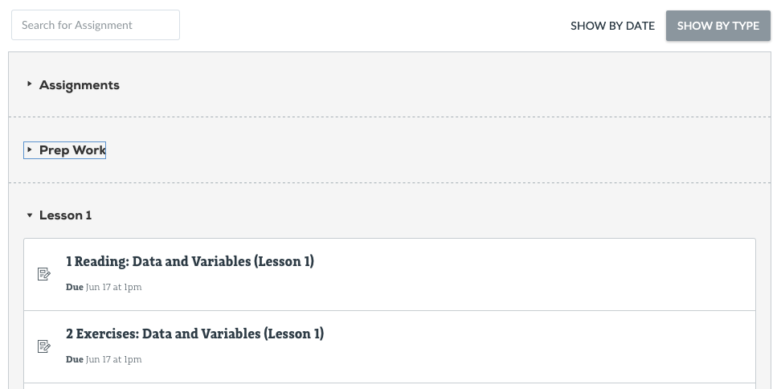
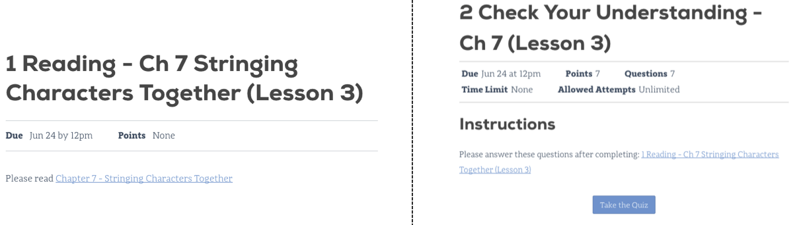

===============
Class Platforms
===============

Besides this book, this class uses additional platforms for enrollment,
assignments, and grading.

Canvas
=======

LaunchCode monitors your progress in this class through a management system
called *Canvas*. It provides a central location to manage the flow of
information, but it does not hold the actual course content. Instead, it links
to the lessons you need, and it keeps a record of your completed assignments
and scores.

Login to Canvas
----------------

Access Canvas and the course assignments at `<https://learn.launchcode.org/>`__.
To login, use your launchcode.org username and password, which are the same
ones you used to apply for this class.

Canvas Dashboard
-----------------

After logging in, you will arrive at your *dashboard*, which displays the
LaunchCode courses you can access, upcoming due dates, and several menu items.

Clicking on a course title takes you to that class' homepage, which shows
upcoming due dates, announcements, general information, and menu options. You
will probably use the *Syllabus* and *Assignments* options the most often.

Syllabus Page
--------------

The syllabus page provides general information such as a description of the
class, the timeline for the course, a calendar, and a To Do list. Scrolling
down on the page shows the *Course Summary*, which holds links to individual
tasks (reading, quizzes, assignments, etc.).

This page is a good place to answer the questions *What do I need to do next*,
and *How can I quickly find and review an old topic*.

.. figure:: figures/course-syllabus-page.png
   :alt: Course Summary list

Assignments Page
-----------------

This page sorts required tasks by date or type. A few days before each class
session, new tasks will appear on the list. Old content remains active,
allowing you to use the links for reference and review.

Clicking on a specific title brings up information about that task, including
the due date, points possible, instructions, and links.

Even though much of the course content can be accessed without logging in, the
best choice is to begin from within Canvas. That way your progress gets
recorded, and your scores will update smoothly as you complete quizzes. Also,
submitting files for the larger assignments should only be done through Canvas.

Repl.it
========

`Repl.it <https://repl.it>`__ is a free online code editor, and it provides a
practice space to boost your programming skills.

For this class, repl.it serves two purposes:

#. To provide opportunities to respond to prompts, questions, and "Try It"
   exercises embedded within the reading. These tasks are neither tracked nor
   scored.
#. To hold larger exercises and studios that will be checked for accuracy and
   tracked for completion.

Repl.it Account Creation
-------------------------

Creating a repl.it account is covered in
:ref:`Chapter 2 <create-replit-account>`, and logging in allows students to
complete the general practice tasks.

Repl.it
-----------------

Repl.it is an online code editor for various languages. Coders
collaborate by sharing repl.it URLs.

Repl.it is used for:

#. Publicly sharing code examples and starter code
#. A place to practice new concepts by writing and running code

.. admonition:: Tip

   You NEVER have to click save when using repl.it. 
   Repl.it automatically saves your code on their servers.

.. admonition:: Note

   Remember, Canvas holds student grades and quizzes but NOT the course content.
   Instead, it provides *links* to the reading and other assignments.
