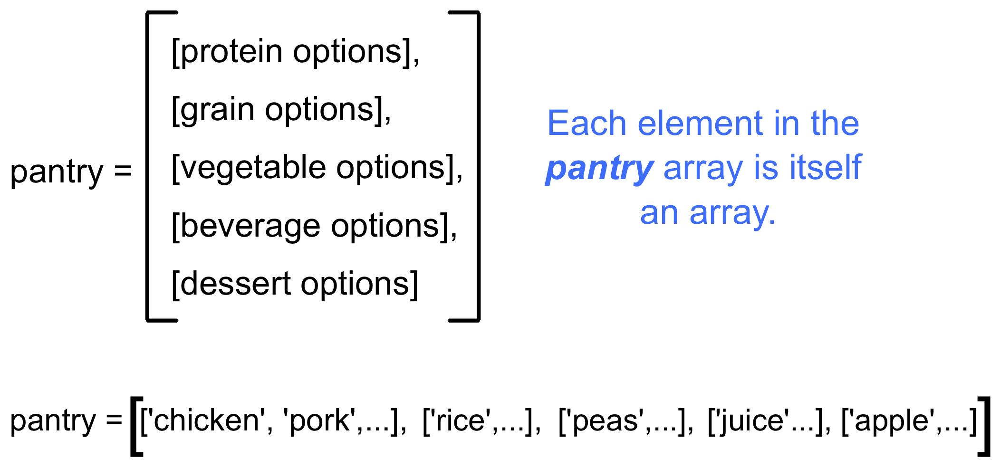

.. _loop-studio:

Studio: Loops
=============

Now that we've launched our shuttle, let's use loops (iteration) to
automate some tasks.

Part A (Put dinner together)
----------------------------
#. First, initialize variables to store the following arrays.  Remember to use descriptive names.

   - Protein options:

     ::

        {"chicken", "pork", "tofu", "beef", "fish", "beans"}

   - Grain options:

     ::

        {"rice", "pasta", "corn", "potato", "quinoa", "crackers"}

   - Vegetable options:

     ::

        {"peas", "green beans", "kale", "edamame", "broccoli", "asparagus"}

   - Beverage options:

     ::

        {"juice", "milk", "water", "soy milk", "soda", "tea"}

   - Dessert options

     ::

        {"apple", "banana", "more kale", "ice cream", "chocolate", "kiwi"}

`Code it at replt.it <https://repl.it/@launchcode/LoopstudiopartsAandB-CSharp>`__

2. Use a ``for`` loop to assemble 6 meals.

   a. The meals must include one item from each of the source arrays.
   b. Each ingredient can only be used ONCE.
   c. Print out each meal.

   

Part B (Refinements)
--------------------

Update your code from part A to add user input and validation.

3. Using a ``while`` loop, ask the user to select the number of meals to assemble. Validate the input to make sure it is an integer from 1 - 6.

4. **Bonus Mission:** *(Optional)  To enhance your learning, modify your code to:*
   
   a. Use string formatting to print something more interesting than a list of "chicken", "rice", "peas", "juice", "apple" for the meal outputs.
   b. Use an "array of arrays" to store the food options in a 'pantry'.
   c. Modify your code to check each meal for kale. If present, after the meal output add, "Don't worry, you can have double chocolate tomorrow."

Part C (Self-destruct system)
-----------------------------

If the shuttle gets hijacked by space pirates, the astronauts can activate
a self-destruct sequence to provide some drama for the viewers at home.

In order to prevent a rogue astronaut from activating the code, it takes
*two* crew members to begin the countdown.  Each person must enter a
different code, after which the computer will "zip" them together before
overloading the engines.

For the purposes of easier (human) readbility, try using the following console method ``Console.Write``. How is it different from ``Console.WriteLine``?  

5. Construct a ``for`` loop that combines two strings together, alternating the characters from each source on a new line.

   .. admonition:: Examples

      #. If ``string partOne = "1234"`` and ``string partTwo = "5678"``, then the output will be "15263748".
      #. If ``string code1 = "ABCDEF"`` and ``string code2 = "notyet"``, then the output will be "AnBoCtDyEeFt".
      #. If ``string ka = "LoOt"`` and ``string blam = "oku!"``, then the output will be ``"LookOut!"``.

   `Code it at replt.it <https://repl.it/@launchcode/LoopstudiopartB-CSharp>`__

