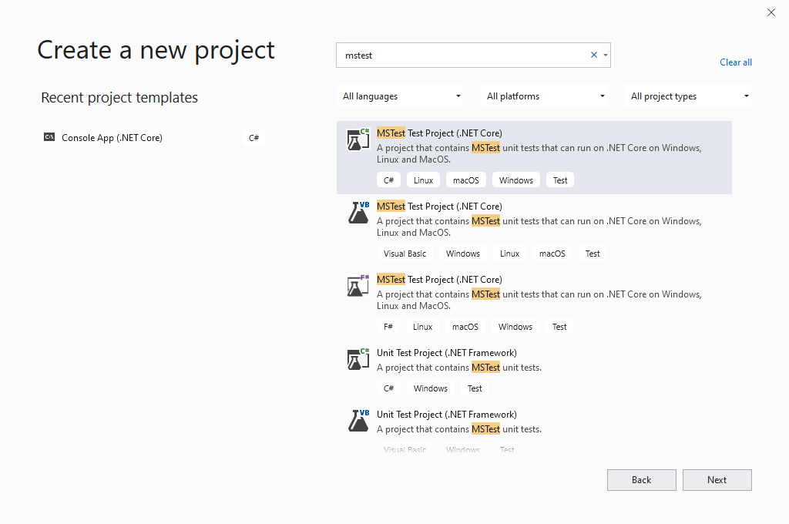

Unit Testing In Action With MSTest
====================================

Testing is a bit of an art; there are no hard and fast rules about how to write good tests.
That said, there are some general principles that you should follow.  
In this section, we will explore some of these. 

In particular, we will focus on identifying good **test cases** by working through a specific example.
We will start with a very simple example which will allow us to explore formatting, positive/negeative tests, edge cases, 
then create a larger project using multiple tests.

**MSTest** is a framework that provides the methods and assertions for writing and executing unit tests in C#. 

What To Test
---------------

When writing tests for your code, what should you test?
You can't test *every* possible situation or input.  
But you also don't want to leave out important cases.  
A method or program that isn't well-tested might have bugs lurking beneath the surface. 

.. admonition:: Note

   Since we are also focused on *unit* testing, in this chapter we will generally use the term "unit" to refer to the methor or program under consideration

Regadless of the situation, there are three types of test cases you should consider: positive, negative and edge cases.

#. A **positive test** verifies expected behavior with valid database
#. A **negative test** verifies expected behavior with *invalid* data.
#. An **edge case** is a subset of positive tests, which checks the extreme edges of valid values.

.. admonition:: example

   Imagine a method named ``SetTemperature`` that accepts a number between ``50`` and ``100``. 
   #. Positive test values: ``56``, ``75``, ``80``
   #. Negative test values: ``-1``, ``101``, ``1000``
   #. Edege case values: ``50``, ``100``

Considering positive, negative, and edge tests will go a long way toward helping you create well-tested code.

Let's see these in action by writing tests for our **SOME MYSTERY CODE**

WHAT CODE DO WE WANT?
^^^^^^^^^^^^^^^^^^^^^^

* **TempExecptions from early code blocks?**
      - they have seen this before
      - would this make them question why we bothered with exceptions? (maybe this could be a good discussion point)
* **IsPalindrome from methods studio??**
      - not all would have a working palindrome, but would it matter?
      - find block `here <https://gitlab.com/LaunchCodeEducation/csharp-web-dev/unit-1/solutions/-/blob/master/Studios/Methods/Methods.cs>`_
* **Build on the Car/CarTest example?**
      - already part of the chapter and repo (no extra building)
      - could demo with EmptyTest then apply it to GasTankLevel???
      - this would transition into the rest of the testing examples (same repo)

.. _csharp-attributes:

.. index:: ! TestClass, ! TestMethod

C# Attributes
-------------

.. index:: ! attributes

In C#, **attributes** are formalized bits of information about a program. They operate
somewhere between actual code syntax and a comment on the code. Attributes do not 
directly affect the code they annotate, but they do supply information to the compiler.
An attribute is enclosed in square brackets, ``[]``, and placed above the item it decorates. 

To run unit tests using the native tools available in Visual Studio, the attributes **[TestClass]** and 
**[TestMethod]** are used to indicate that certain classes and methods should be treated as test cases. We 
describe how to use these in the examples that follow.

Testing Setup
-------------

.. index:: ! dependency

To test a simple .NET Core console project, we add an MSTest project into the same solution. An MSTest 
project is a console project with an added MSTest dependency.

Fork and clone `this repo <https://github.com/LaunchCodeEducation/csharp-web-dev-lsn5unittesting>`__. Inside the solution, we have two projects,
``Car`` and ``CarTests``. The ``Car`` project is a simple .NET Console app like the others you have encountered
in this course so far. ``CarTests`` is a new type of project, MSTest Project. 

On a Mac, to select this type of project looks like so:

.. figure:: ./figures/mac-create-mstest-project.png
   :alt: MAC: User selects MSTest project template in Visual Studio

   MAC: Creating MSTest project in Visual Studio

On a Windows:

   WINDOWS: Creating MSTest project in Visual Studio

MSTest is a C# testing framework. When we create a Visual Studio MSTest Project, the 
necessary API and classes are added as **dependencies** of the ``CarTests`` project. A dependency 
is a separately developed program or piece of code that another program or piece of code 
uses to carry out its function. Our C# tests will *depend* on MSTest code. 

Along the same lines, since ``CarTests`` tests the methods inside of ``Car``, we must add the 
``Car`` project as a dependency of ``CarTests``.

Right click on the ``Dependencies`` directory in ``CarTests`` and add a reference to 
the ``Car`` project.

.. figure:: ./figures/vs-add-dependency-reference.png
   :alt: User selects project to add as a dependency reference to test project

   Add main project as dependency for test project

``Car`` and ``CarTests``
^^^^^^^^^^^^^^^^^^^^^^^^

Open the ``Car`` class and look around. Here, we provide a class, ``Car``, with basic 
information about a make, model, gas level, and mileage. We also give it getters, setters, and a few other methods. 

In the same project, the ``Program`` class contains a main method that prints the
``make`` and ``model`` of a given ``Car`` object. Run the project to verify it works.
Now, open ``CarTests``. It's empty, save for a few TODOs. Let's tackle the
first TODO to make a new empty test. Starting with an empty test lets us validate that we can 
use MSTest in our current environment.

.. index:: ! test runner

``[TestClass]`` and ``[TestMethod]``
------------------------------------

Another benefit of coding in an IDE, Visual Studio contains its own **test runner**. A test runner is 
simply a tool to execute tests and deliver their results. In order to indicate that ``CarTests`` contains
unit tests that we want the test runner to run, we must give it the ``[TestClass]`` attribute. As you might 
guess, ``[TestMethod]`` annotates a method to signal it as a test case. Both of these attributes come to us 
via the Visual Studio test runner.

In ``CarTests``, on top of ``public class CarTests``, add ``[TestClass]``. Then, create the following empty 
test underneath the first TODO. As usual, be sure write this code rather than copy/paste it:

.. sourcecode:: c#
   :linenos: 

   using Microsoft.VisualStudio.TestTools.UnitTesting;

   namespace CarTests
   {
      [TestClass]
      public class CarTests
      {
         //TODO: add emptyTest so we can configure our runtime environment
         [TestMethod]
         public void EmptyTest() {
            Assert.AreEqual(10,10,.001);
         }
         // ... other TODOs omitted here
      }
   }

Our empty test is aptly named ``EmptyTest()`` as a description of its role. This test does 
not follow the AAA rule from our :ref:`testing-best-practices`, as it jumps straight to 
asserting. Nor is it relevant, for that matter. The goal of this empty unit test is not to 
demonstrate all of our best practices, but rather, to verify that our testing setup is in place.

The three arguments in our test care defined as "expected", "actual", and "delta". This empty test 
asserts an expected value of ``10`` to equal an actual value of ``10``, 
with an accepted ``.001`` variance. 

.. admonition:: Note

   The third argument, called ``delta``, is the amount of allowed difference between the 
   expected and actual values. If the difference between the two values is within 
   that range, then the test still passes. 
   This argument is optional for some comparisons and required for others. One 
   scenario in which it is required is when comparing doubles. 

   Why is it required? Well, that's kind of a long story. Some number types are 
   `floating-point numbers <https://en.wikipedia.org/wiki/Floating-point_arithmetic>`__. 
   Due to the nature of their storage, these types carry with them a certain 
   degree of 
   `inaccuracy <https://en.wikipedia.org/wiki/Floating-point_arithmetic#Accuracy_problems>`__. 
   In brief, the ``delta`` argument ensures we can still reasonably compare two doubles.

.. admonition:: Tip

   Visual Studio can offer info on the parameters of a previously defined function.
   Hover over the function call to see a tooltip:

   .. figure:: ./figures/function-parameters-tooltip.png
      :alt: User hovers mouse over a function to see its parameter names

      Hover over a function to see its parameters

Of course, ``10`` equals ``10``. But let's run it so 
we know our test runner works. 

Like running console projects, there are many ways to run unit tests and view the results. Here are
some options to try:

Mac Users: Running Tests
^^^^^^^^^^^^^^^^^^^^^^^^

For Mac users, run the ``CarTests`` project just like you would any other project. 

.. admonition:: Note

   If the panel does not open once the test are finished running, look for the *Test Results* panel name on
   the margins of your IDE and open it manually.

Windows Users: Running Tests
^^^^^^^^^^^^^^^^^^^^^^^^^^^^

For Windows users, you'll want to find and open the *Test Explorer* panel. If you don't already have it docked, 
you can find it listed in the top *Test* menu. 

.. figure:: ./figures/vs-windows-test-explorer.png
   :alt: WINDOWS: User selecting Test Explorer option in Visual Studio Test Menu

   WINDOWS: Visual Studio open Test Explorer

With the panel open, select the *Run All Tests* option.

.. admonition:: Note

   If you see that the test fails to run, neither passing nor failing, you may need to adjust a setting to use
   64bit processing.

   .. figure:: ./figures/vs-windows-process-architecture-setting.png
      :alt: WINDOWS: User selecting x64 option from Test Explorer/Settings/Processor Architecture for AnyCPU Projects in Visual Studio

      WINDOWS: Set Test Explorer to use x64 process

   You may also need to update some of the testing packages. Right click on the 
   ``CarTests`` project and select *Manage NuGet Packages...*. If you see some items
   in the *Update* section of the panel that opens, run the updates. Close and reopen 
   the *Team Explorer* panel and *Visual Studio* to ensure the changes are applied.

All Users: Output and Adding More Tests
^^^^^^^^^^^^^^^^^^^^^^^^^^^^^^^^^^^^^^^

Once you run the test, you will see a new output panel with a green check mark indicating the test passed 
and a message stating the test passed. 

We know now how the test runner behaves when a test passes and can begin the real work of unit 
testing the ``Car`` class. One responsibility of the ``Car`` class constructor is to set its initial 
``gasTankLevel`` field. This field is determined by the constructor argument for ``gasTankSize`` . 

``Car.cs``:

.. sourcecode:: c#
   :lineno-start: 17

   // Gas tank level defaults to a full tank
   GasTankLevel = gasTankSize;

This class-specific behavior is a good item to test. Under your second TODO, write a test to verify that the 
constructor sets the ``gasTankLevel`` field.

.. admonition:: Note

   To test the ``Car`` class, we must make it available to us by adding ``using CarNS;`` to the top of your 
   file. ``CarNS`` is the **namespace** we have assigned to the ``Car`` class. Namespaces are used in C# to 
   organize code. You've seen them before in other :ref:`using statements <using-statement>`.

.. sourcecode:: c#
   :lineno-start: 16

   //TODO: constructor sets gasTankLevel properly
   [TestMethod]
   public void TestInitialGasTank()
   {
      Car test_car = new Car("Toyota", "Prius", 10, 50);
      Assert.AreEqual(10, test_car.GasTankLevel, .001);
   }

Here, we give the test a descriptive name, ``TestInitialGasTank()``, initialize a new 
``Car`` object, and test that the constructor correctly sets the ``gasTankLevel`` field.

We've done our best to address :ref:`testing-best-practices`:

#. The AAAs
   
   #. We arrange the one variable our test requires: ``test_car``.
   #. We act on the ``Car`` constructor method as well: ``new Car("Toyota", "Prius", 10, 50);``.
   #. We assert that the expected value of ``10`` will equal the actual value returned from getting the 
      tank level (``test_car.GasTankLevel``).

#. Deterministic

   As it is written, we expect that our test will always pass.

#. Relevant

   This is our first real test, so we don't yet have much to group it with. That said, the test assesses a method 
   in ``Car`` and is situated in a class called ``CarTests``, so it meets the minimum requirements or relevancy.
   The next section gives us another attribute to use to help group testing variables.

#. Meaningful

   Our test evaluates a simple field assignment but it is not trivial. The line in the constructor being tested 
   is not very complex, but this makes for a good unit test. We want to make sure the basic functionality of our 
   class works as we expect.

Run ``CarTest`` to see that both tests pass. 

.. admonition:: Tip

   If you want to rerun only one test, right click on its listing in the results pane.

Check Your Understanding
--------------------------