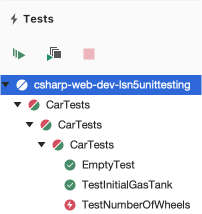
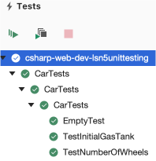

.. _tdd:

Test-Driven Development
=======================

.. index:: ! TDD

.. index::
   single: TDD; test-driven development

.. index::
   single: unit testing; TDD

Now that we know more about unit testing, we are going to learn a new way of using them.
Unit testing can easily be added to *existing* code, but what if you could build tests
to verify functionality of code that doesn't exist yet.  This may sound
odd, but this process has many benefits as we will learn.

As the name sounds, **Test-driven development (TDD)** is a software development
process where the unit tests are written first. However, that doesn't tell the
entire story. Writing the tests first and intentionally thinking more about the
code design leads to better code. The name comes from the idea of the tests
*driving* the development process.

Before we can start using TDD, we need a list of discrete features that can be turned into
unit tests. This will help keep our tests focused on specific functionality which should
lead to code that is easy to read. Along the way we will build confidence as we add features.

.. admonition:: Note

   TDD is a process that some organizations choose to use. Using the TDD
   process is not required when using unit tests.

.. _test-code-cycle:

The Test/Code Cycle
-------------------

With TDD you start with the unit test first. Each test must *clearly describe*
the behavior it is testing.

.. admonition:: Example

   Example test case for our ``Car`` project:

   * We want to verify the number of wheels.  

Because the test is for a feature that does NOT exist *yet*, we need to think
about how the feature will be implemented. This is the time to ask questions
like: *Should we add a new property? What about an entirely new constructor?
Where would this data best work within our code?*

.. admonition:: Example

   How could we implement our test case? Remember we aren't writing the code
   yet, only thinking about the design.

With the design in mind, write the unit test as if the property you imagined *already*
exists. This may seem a bit odd, but considering how the new code will be used
helps find bugs and flaws earlier. We also have to use test utilities such as
``Assert.AreEqual`` to clearly demonstrate that the proposed new code
functions properly.

Next, type out the ideas into an actual test. In this example, the test
references a module and a method that have not been created yet. The code
follows the plan we came up with earlier. Very importantly, there is an
``Assert.AreEqual`` that verifies an array is returned.

.. admonition:: Example

   .. sourcecode:: csharp
      :lineno-start: 20

      //within the CarTests class

      [TestMethod]
      public void TestNumberOfWheels()
      {
         Car test_car = new Car("Toyota", "Prius", 10, 50);
         Assert.AreEqual(4, test_car);
      }

   *Note* that the ``test_car`` in **Line 26** is the entire object right now.  
   This is because no *number of wheels* property exists in the ``Car`` class yet.  
   Think of this as a placeholder, that you will update as we move forward.

Now run the test! The test should fail (or not compile at all) because you have
referenced code that does not exist yet.

      Failed the ``NumberOfWheels`` test.  Let's refactor our code.

Finally, write code to pass the new test. In the earlier chapters, this is
where you started, but with TDD writing new code is the *last* step.

To make the new test pass, a property must be created that will implement a ``NumberOfWheels`` property.

.. admonition:: Example
   
   .. sourcecode:: csharp
      :lineno-start: 10 

      //in the Car class

      public int NumberOfWheels { get; set; }

Now that we have updated the ``Car`` properties, we should look at our constructor.
Add ``NumberOfWheels`` to the constructor.  
Once this is complete, check your ``Car`` objects.  
You will most likely see some red squiggles under your ``new Car`` objects.  
Update your ``Car`` objects accordingly. 

.. admonition:: Example

   .. sourcecode:: csharp
      :lineno-start: 20

      //within the CarTests class

      [TestMethod]
      public void TestNumberOfWheels()
      {
         Car test_car = new Car("Toyota", "Prius", 10, 50, 4);
         Assert.AreEqual(4, test_car.NumberOfWheels);
      }

Now when you run your tests, they should all pass.  Great job!

      All green!  All tests passed!

Coding this way builds confidence in your work. No matter how large your code
base may get, you know that each part has a test to validate its functionality.

.. admonition:: Example

   Now that we have one passing test for our data parser project, we could
   confidently move on to writing tests and code for any other remaining features.

Red, Green, Refactor
--------------------

.. index:: ! red green refactor

.. index::
   single: TDD; red green refactor

.. index::
   single: TDD; red, green, refactor

.. index::
   single: unit testing; red green refactor

While adding new features and making our code work is the main goal, we also
want to write readable, efficient code that makes us proud. The **red, green,
refactor** mantra describes the process of writing tests, seeing them pass, and
then making the code better. As the name suggests, the cycle consists of three
steps. Red refers to test results that fail, while green represents tests that
pass. The colors refer to test results which are often styled with red for
failing tests and green for passing tests.

#. Red -> Write a failing test.
#. Green -> Make it pass by implementing the code.
#. Refactor -> Make the code better.

   .. figure:: figures/red-green-refactor.png
      :alt: Graphic showing the cycle of phases from red the writing test, green making the test pass, and blue of refactoring code to be better which points back to red.

      Red, green, refactor cycle.

.. index:: ! refactor

**Refactoring code** means to keep the same overall feature, but change how
that feature is implemented. Since we have a test to verify our code, we can
change the code with confidence, knowing that any error will be immediately
identified by the test. Here are a few examples of refactoring:

#. Using different data structures,
#. Reducing the number of times needed to loop through an array,
#. Moving duplicate logic into a function so it can be reused.

The refactor is also done in a TDD process:

#. Decide how to improve the implementation of the feature,
#. Change the unit test to use this new idea,
#. Run the code to see the test fail,
#. Refactor the code to implement the new idea,
#. Finally, see the test pass with the refactored design.
